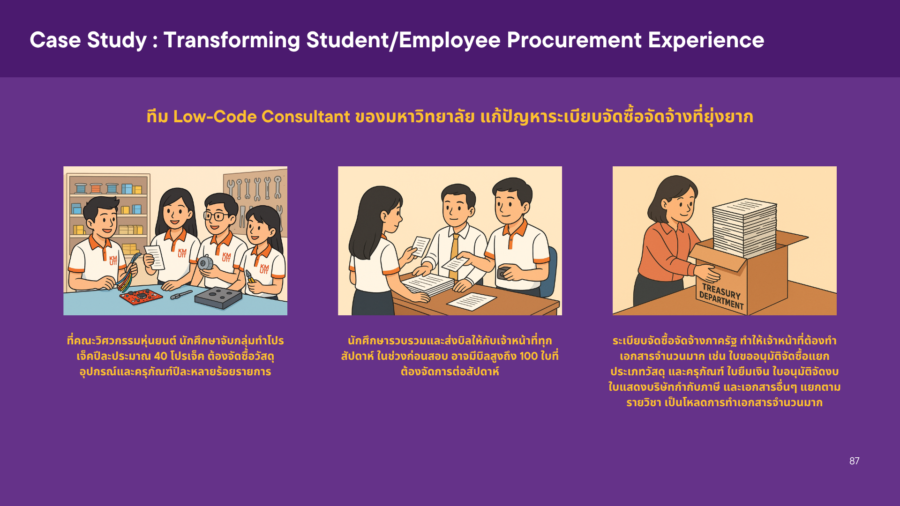
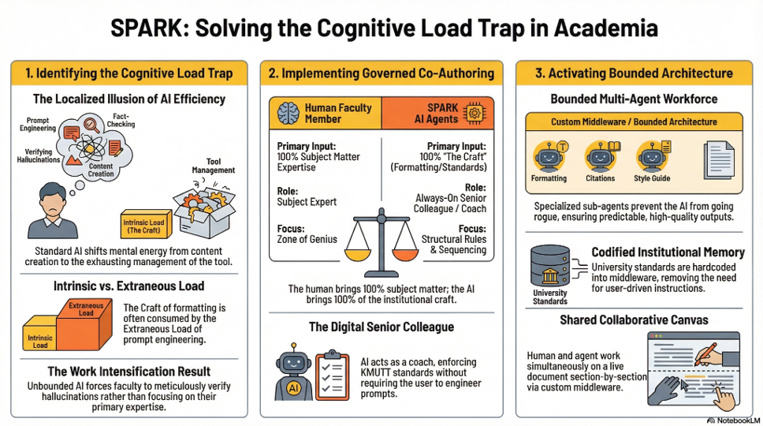

# Infographics

---

**AI Case Study Illustration** — สร้างด้วย **ChatGPT Image Generation**

ใช้ AI สร้างภาพประกอบสำหรับสไลด์ Case Study แทนการหาภาพ Stock เพียงบอก AI ถึงฉากและตัวละครที่ต้องการ ได้ภาพที่ตรงกับเนื้อหาทันที

  

---

**SPARK Infographic** — สร้างด้วย **NotebookLM Infographic Feature**

ใช้ฟีเจอร์ Infographic ของ NotebookLM สร้างภาพสรุปงานวิจัย SPARK AI Agent โดยใส่ prompt พิเศษเพื่อควบคุม color scheme และสไตล์กราฟิกให้เข้ากับ brand มหาวิทยาลัยและน้ำเสียงเชิงวิชาการ

  

