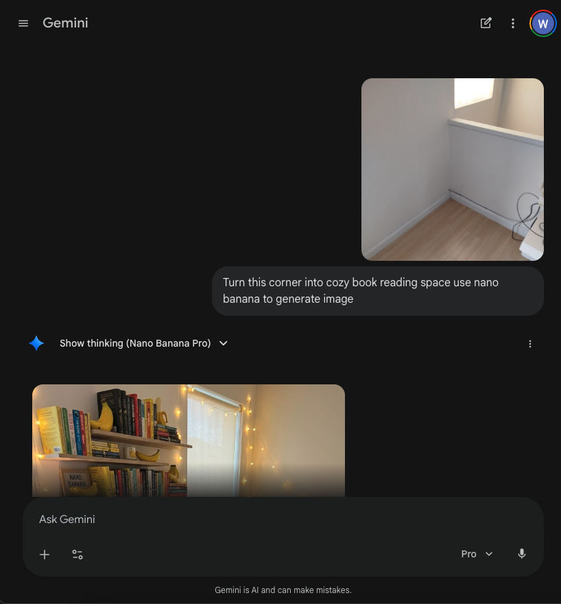
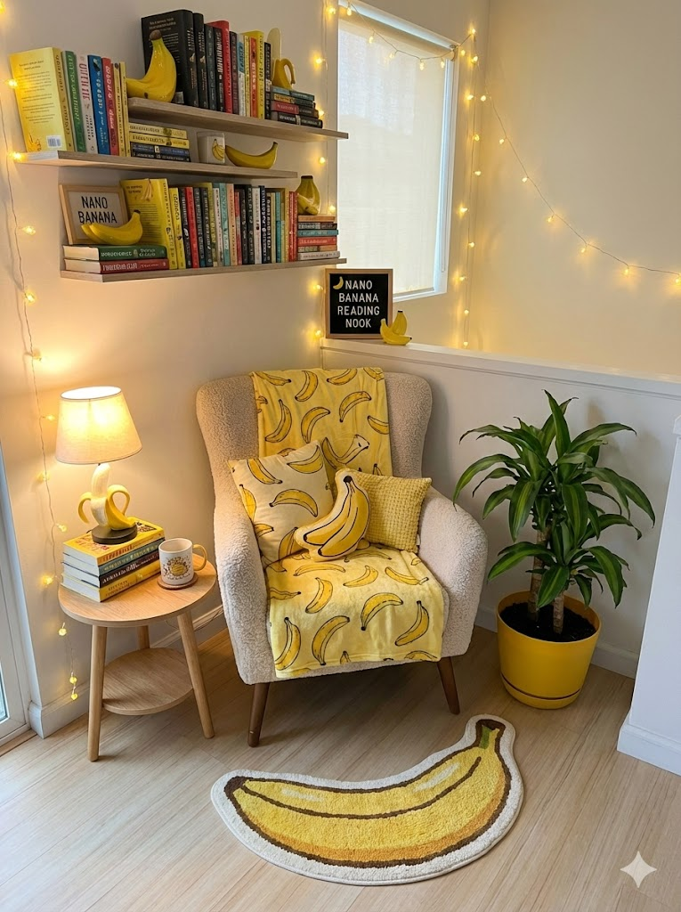
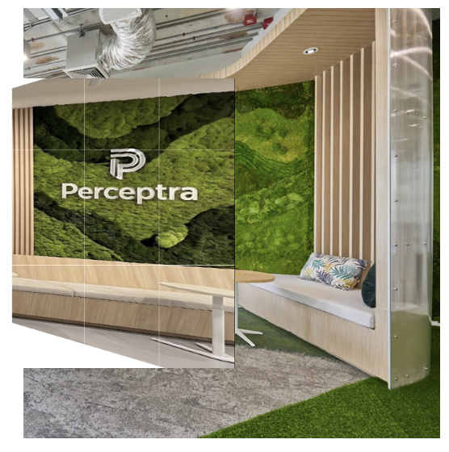
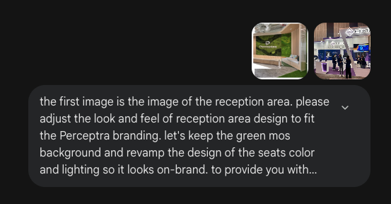
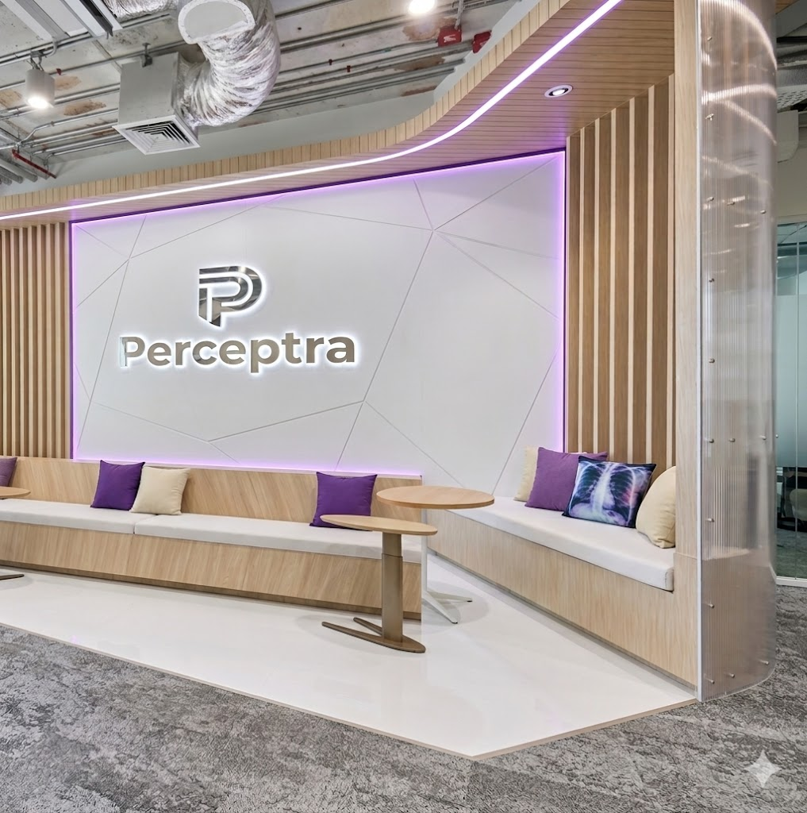
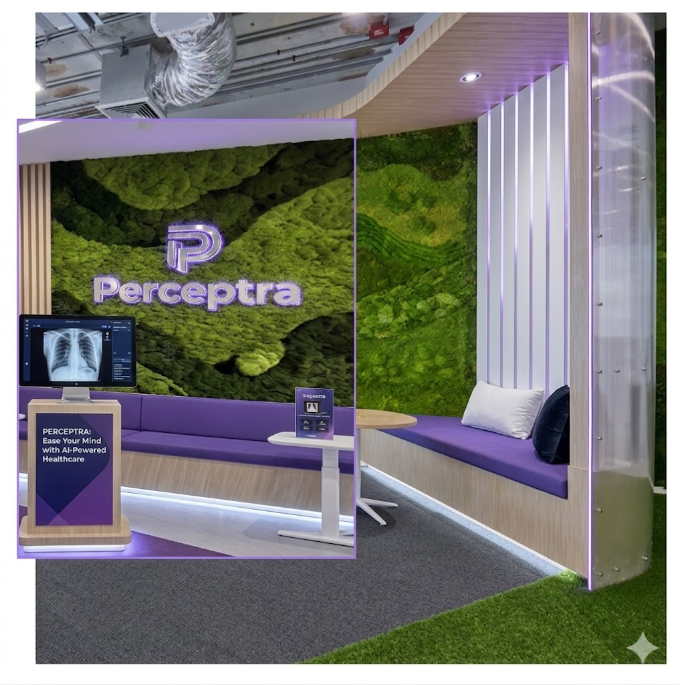

# Interior Design

---

ออกแบบมุมห้องโดยใช้ภาพถ่ายจริงเป็นจุดตั้งต้น ออกแบบด้วย **Gemini Nano Banana**

**Prompt ที่ใช้:**

  

**ผลลัพธ์:**

  

---

**ตัวอย่างตกแต่งออฟฟิศ:**

คิดจนปวดหัว จะออกแบบออฟฟิสยังไงดี?

  

เพิ่มความเป็นแบรนด์เราเข้าไปหน่อยละกัน

  

**ผลลัพธ์:**

น้องเติมหมอนน่ารักๆให้ด้วย (nano banana เป็นคนตลก)

  

  

