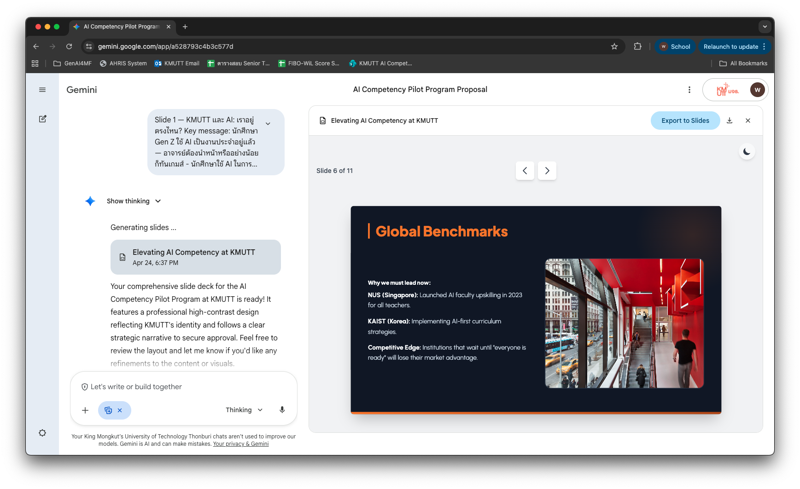
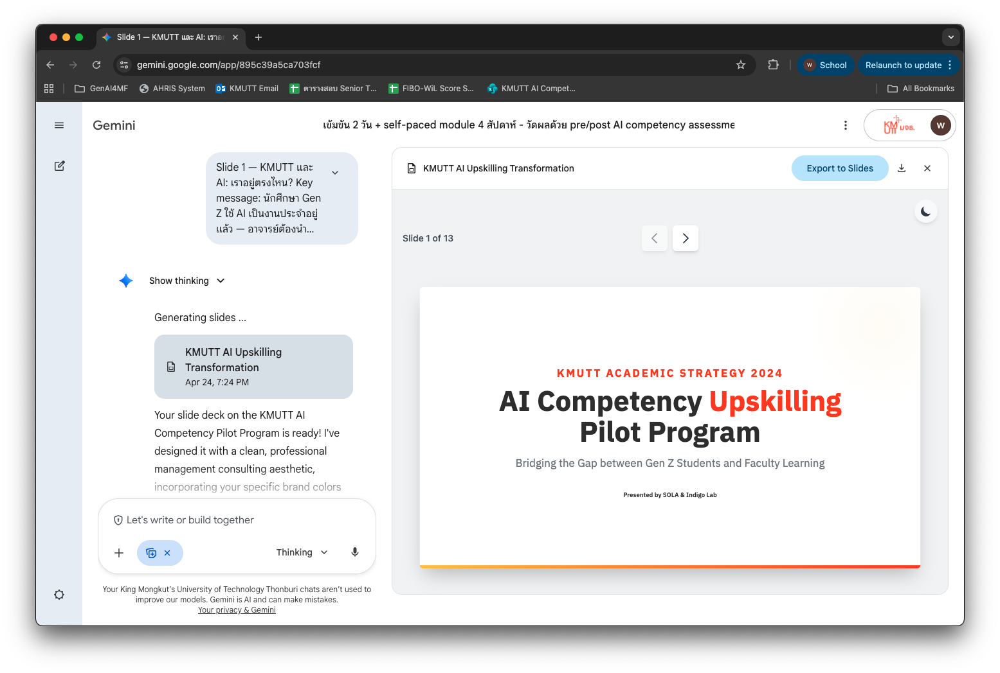
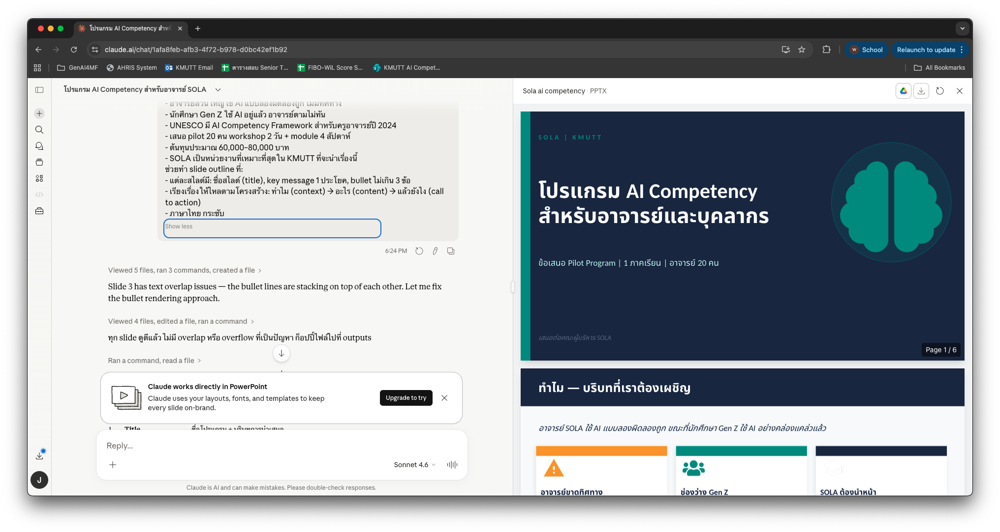
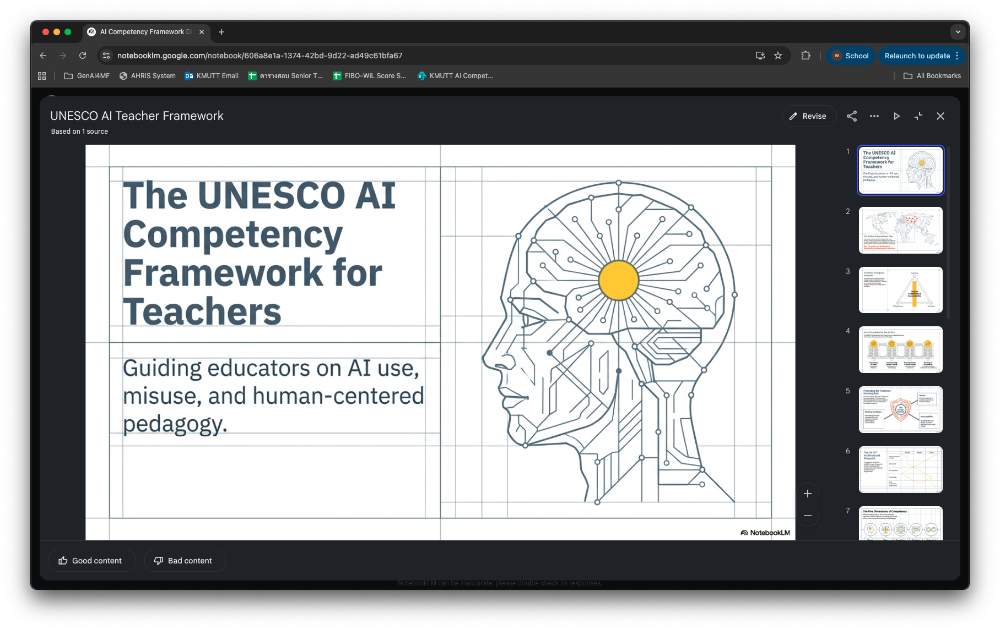
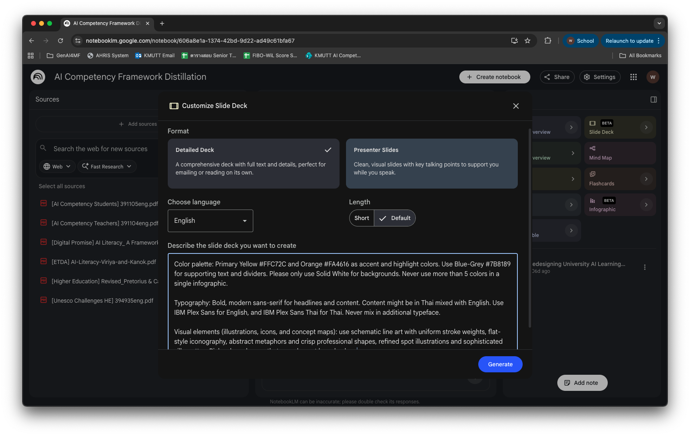

# Presentation Toolkit — จาก content สู่สไลด์ด้วย AI

ปัญหาที่เกิดขึ้นบ่อยที่สุดตอนทำสไลด์: เปิด PowerPoint หรือเครื่องมือ AI ก่อน แล้วค่อยคิดว่าจะพูดอะไร — ผลที่ได้คือสไลด์ที่ดูดีแต่เนื้อหาไม่แน่น หรือเนื้อหาแน่นแต่ยัดใส่สไลด์เกินไป

วิธีที่ถูกต้อง: **คิดเนื้อหาก่อน ออกแบบทีหลัง**

หน้านี้จะสอน 2 ขั้นตอน โดยใช้สถานการณ์จริง: **การทำสไลด์โน้มน้าวทีม SOLA มหาวิทยาลัย KMUTT ให้รับโปรแกรม AI competency สำหรับอาจารย์และบุคลากร**

1. **ใช้ ChatGPT หรือ Claude กลั่นเนื้อหา** ให้อยู่ในรูปแบบที่พร้อมทำสไลด์
2. **ป้อนผลลัพธ์เข้า Gemini Canvas** พร้อม prompt ที่ควบคุม brand และ layout

---

## แบบฝึกหัดที่ 1: กลั่นเนื้อหาด้วย ChatGPT หรือ Claude

**สถานการณ์:** คุณเพิ่งประชุมกับทีม SOLA ที่ KMUTT และต้องทำสไลด์โน้มน้าวให้พวกเขาอนุมัติโปรแกรม AI competency สำหรับอาจารย์ คุณมีข้อมูลอยู่ 3 แบบ — เลือก กรณีที่ตรงกับตัวคุณ

ขั้นตอนนี้ยังไม่ต้องเปิด Gemini Canvas เลย ทำใน ChatGPT หรือ Claude ก่อน

---

## กรณีที่ 1 — มีแค่ notes คร่าวๆ จากการประชุม

### ลองทำ

```prompt
ฉันต้องทำ presentation เรื่อง: ข้อเสนอโปรแกรม AI Competency สำหรับอาจารย์และบุคลากร SOLA มหาวิทยาลัย KMUTT
ผู้ฟัง: คณะผู้บริหาร SOLA ที่ต้องตัดสินใจอนุมัติโปรแกรม — มีทั้งคนที่สนับสนุน AI และคนที่ยังไม่แน่ใจ
เป้าหมาย: ให้ผู้บริหาร SOLA อนุมัติ pilot program 1 ภาคเรียนกับอาจารย์ 20 คน
จำนวนสไลด์: ไม่เกิน 6 สไลด์
เวลานำเสนอ: 15 นาที

ข้อมูลที่ฉันมี:
- อาจารย์ส่วนใหญ่ใช้ AI แบบลองผิดลองถูก ไม่มีทิศทาง
- นักศึกษา Gen Z ใช้ AI อยู่แล้ว อาจารย์ตามไม่ทัน
- UNESCO มี AI Competency Framework สำหรับครูอาจารย์ปี 2024
- เสนอ pilot 20 คน workshop 2 วัน + module 4 สัปดาห์
- ต้นทุนประมาณ 60,000–80,000 บาท
- SOLA เป็นหน่วยงานที่เหมาะที่สุดใน KMUTT ที่จะนำเรื่องนี้

ช่วยทำ slide outline ที่:
- แต่ละสไลด์มี: ชื่อสไลด์ (title), key message 1 ประโยค, bullet ไม่เกิน 3 ข้อ
- เรียงเรื่องให้ไหลตามโครงสร้าง: ทำไม (context) → อะไร (content) → แล้วยังไง (call to action)
- ภาษาไทย กระชับ
```

??? note "ตัวอย่างผลลัพธ์ที่ได้"

    **Slide 1 — KMUTT และ AI: เราอยู่ตรงไหน?**
    Key message: นักศึกษา Gen Z ใช้ AI เป็นงานประจำอยู่แล้ว — อาจารย์ต้องนำหน้าหรืออย่างน้อยก็ทันเกมส์
    - นักศึกษาใช้ AI ในการเรียน วิจัย และงานกลุ่มทุกวัน
    - อาจารย์ส่วนใหญ่ยังใช้แบบลองผิดลองถูก ไม่มี framework
    - ช่องว่างนี้กำลังกว้างขึ้นทุกภาคเรียน

    **Slide 2 — AI Competency คืออะไร (ไม่ใช่แค่ใช้ ChatGPT เป็น)**
    Key message: AI competency คือรู้จักเลือกใช้ ตั้งคำถาม และรับผิดชอบผลลัพธ์
    - 3 ระดับ: Awareness (รู้จัก) → Application (ใช้ได้) → Integration (ฝังในการสอน)
    - อ้างอิง UNESCO AI Competency Framework for Teachers 2024
    - SOLA มีภารกิจด้านการเรียนรู้ที่ตรงกับเนื้อหานี้มากที่สุดใน KMUTT

    **Slide 3 — ทำไม SOLA ต้องนำ ไม่ใช่รอ**
    Key message: มหาวิทยาลัยที่รอให้ทุกคนพร้อมก่อนจึงค่อยเริ่ม จะไม่มีวันเริ่ม
    - NUS และ KAIST มีโปรแกรม AI upskilling สำหรับอาจารย์แล้วตั้งแต่ปี 2023
    - SOLA ในฐานะหน่วยงานด้านการเรียนรู้คือ natural owner ของเรื่องนี้
    - การเริ่มเร็วกว่าคือข้อได้เปรียบ ไม่ใช่ความเสี่ยง

    **Slide 4 — สิ่งที่เสนอ: Pilot Program 1 ภาคเรียน**
    Key message: เริ่มเล็ก วัดผล แล้วขยาย — ไม่ได้ขอ commit ทั้งมหาวิทยาลัยตั้งแต่วันแรก
    - กลุ่ม pilot: อาจารย์และบุคลากร 20 คน คัดเลือกจากหลายคณะ
    - รูปแบบ: Workshop เข้มข้น 2 วัน + self-paced module 4 สัปดาห์
    - วัดผลด้วย pre/post AI competency assessment

    **Slide 5 — ต้นทุนและสิ่งที่คาดหวัง**
    Key message: ลงทุน 60,000–80,000 บาท เพื่อให้ได้ framework และบุคลากรนำร่องที่พร้อม scale
    - ค่าใช้จ่าย: ~60,000–80,000 บาท รวม content, facilitator, และ assessment
    - ผลลัพธ์ที่วัดได้: อาจารย์ 20 คนผ่าน competency threshold + blueprint สำหรับการขยายต่อ
    - ระยะเวลา: 1 ภาคเรียน เริ่มได้ทันทีถ้าอนุมัติภายในเดือนนี้

    **Slide 6 — ขอ Approve อะไร**
    Key message: ต้องการ 2 อย่าง: อนุมัติงบ และ assign ผู้ประสานงาน 1 คน
    - อนุมัติงบ pilot และกำหนดกลุ่มอาจารย์ภายใน 2 สัปดาห์
    - SOLA assign coordinator — ทีม Indigo Lab รับผิดชอบ content ทั้งหมด
    - นัด kickoff ภายในสิ้นเดือน

---

## ป้อนผลลัพธ์เข้า Gemini Canvas

[Gemini Canvas](https://gemini.google.com) คือฟีเจอร์ใน Gemini ที่สร้างสไลด์ในหน้าเดียวกัน แล้ว export เป็น Google Slides ได้โดยตรง ฟรี และไม่ต้องสมัครเพิ่ม

ข้อดีหลัก: สร้างเร็ว export เข้า Google Slides ได้เลย แก้ไขต่อใน Google Slides ได้ทันที

<div class="ac-gallery ac-gallery-large">
  
</div>

---

### ทำยังไงให้ presentation ที่เราทำดูเป็นแบรนด์ของบริษัท?

เราสามารถบอกให้ Gemini Canvas ใช้ brand spec ของบริษัทได้แค่ใส่ prompt เพิ่มนิดหน่อย

#### ตัวอย่าง brand style prompt

```prompt
Color palette: Primary Yellow #FFC72C and Orange #FA4616 as accent and highlight colors. Use Blue-Grey #7B8189 for supporting text and dividers. Please only use Solid White for backgrounds. Never use more than 5 colors in a single infographic.

Typography: Bold, modern sans-serif for headlines and content. Content might be in Thai mixed with English. Use IBM Plex Sans for English, and IBM Plex Sans Thai for Thai. Never mix in additional typeface.
```

ออกมาสวยเลย

<div class="ac-gallery ac-gallery-large">
  
</div>

---


## ใช้ Claude ก็ได้นะ เดี๋ยวนี้ทำ Powerpoint เก่งขึ้นมากๆ

น้องโชว์เหนือโดยการทำให้เลย ไม่ต้องขอ (ใช้แค่พร้อมท์แรก พร้อมท์เดียว)

<div class="ac-gallery ac-gallery-large">
  
</div>

---

## กรณีที่ 2 — มีเอกสารหรือ framework ที่ยาว

**ตัวอย่าง:** คุณมี AI competency framework for teachers (50+ หน้า) อ่านแล้วไม่ค่อยเข้าใจว่าเขาเขียนอะไร แต่ต้องรีบเอาไปทำสไลด์พรีเซนต์อย่างด่วน

NotebookLM เก่งเรื่องนี้ และเก่งแบบป๋าๆ ตังไม่เก็บนะ แจกฟรีไปเลยจ้าาา

<div class="ac-gallery ac-gallery-large">
  
</div>


มีข้อเสียอย่างเดียวคือมัน generate เป็นภาพ การจะแก้ไขก็ค่อนข้างลำบาก (ทำได้แต่ลำบากนิดนึง) แต่บางครั้งเราไม่รู้จะเล่าเรื่องอย่างไรเลยด้วยซ้ำ ให้ notebooklm ช่วยปั่นออกมา ก็ถือว่าโอเคทีเดียว

### ทำยังไงให้ presentation ที่เราทำดูเป็นแบรนด์ของบริษัท มาดูวิธีเลย

<div class="ac-gallery ac-gallery-large">
  
</div>

---

## กรณีที่ 3 — ต้องหาข้อมูลจากอินเทอร์เน็ตก่อน

**ตัวอย่าง:** คุณรู้ว่าอยากโน้มน้าว SOLA ด้วยตัวเลขและหลักฐาน แต่ยังไม่มีข้อมูลในมือ — ต้องหาก่อน

ใช้ **ChatGPT (เปิด Browse)** หรือ **[Perplexity AI](https://www.perplexity.ai)** ซึ่งค้นอินเทอร์เน็ตได้และอ้างอิง source ให้

### Step 1 — ให้ AI ค้นข้อมูลและรวบรวม evidence

```prompt
ฉันกำลังทำ presentation โน้มน้าวทีมบริหาร SOLA มหาวิทยาลัย KMUTT ให้อนุมัติโปรแกรม AI competency สำหรับอาจารย์และบุคลากร

ช่วยค้นหาและรวบรวมข้อมูลต่อไปนี้:

1. มหาวิทยาลัยชั้นนำในเอเชียหรือระดับโลกที่มีโปรแกรม AI upskilling สำหรับอาจารย์โดยเฉพาะ — มีตัวอย่างอะไรบ้าง และทำอะไร?
2. มี framework หรือ guideline ระดับนานาชาติเกี่ยวกับ AI competency สำหรับอาจารย์ที่อ้างอิงได้ (เช่น UNESCO, EU, ISTE)?
3. มีสถิติเกี่ยวกับ employer demand for AI skills ในตลาดแรงงาน Southeast Asia หรือไทย?
4. ถ้ามีมหาวิทยาลัยไทยที่เริ่มทำเรื่องนี้แล้ว มีตัวอย่างไหมบ้าง?

สำหรับแต่ละข้อ ระบุ source และปีของข้อมูลด้วย
```

??? note "ตัวอย่างผลลัพธ์จาก Perplexity"

    **1. มหาวิทยาลัยที่มีโปรแกรม AI สำหรับอาจารย์**
    - NUS (สิงคโปร์): มีโปรแกรม AI Literacy for Educators ตั้งแต่ปี 2023 บังคับสำหรับอาจารย์ใหม่ทุกคน *(source: NUS Centre for Future-Ready Graduates, 2023)*
    - KAIST (เกาหลีใต้): เปิด AI Faculty Development Program ให้อาจารย์ทุกสาขา ไม่ใช่แค่ CS *(source: KAIST AI Graduate School, 2024)*
    - Tsinghua (จีน): integrate AI tools เข้า faculty training ทุกภาควิชา *(source: Tsinghua AI Education Report, 2023)*

    **2. Framework ระดับนานาชาติ**
    - UNESCO AI Competency Framework for Teachers (2024): แบ่งเป็น 3 ระดับ — Acquire, Deepen, Create — ครอบคลุมทั้งทักษะใช้งาน การสอน และจริยธรรม
    - EU AI Literacy Framework (2023): เน้น AI understanding + critical use สำหรับบุคลากรการศึกษา

    **3. Employer demand ใน Southeast Asia**
    - LinkedIn Emerging Jobs Report (2024): AI-related skills ติด top 3 ทักษะที่นายจ้างใน SEA ต้องการมากที่สุด
    - WEF Future of Jobs 2025: 60% ของงานใน ASEAN จะต้องการ AI literacy ภายในปี 2030

!!! warning "ข้อมูลจาก AI Search ต้องตรวจก่อนนำไปใช้"
    - **ตรวจ source ที่ AI อ้างถึงทุกอัน** — Perplexity มักให้ link มาด้วย ให้คลิกและตรวจว่า source จริงๆ บอกแบบนั้น ตัวเลขที่ AI รายงานอาจ paraphrase ผิดเล็กน้อยได้
    - **ระวัง source ที่เก่าเกินไป** — ข้อมูล AI เปลี่ยนเร็ว ถ้า source เก่ากว่า 2023 ให้หาข้อมูลใหม่ทดแทน
    - **ตัวเลข % และสถิติ** ต้องอ่านต้นฉบับโดยตรงก่อนใส่สไลด์ — อย่าเชื่อแค่ที่ AI สรุปมา

### Step 2 — สร้าง slide outline จาก evidence ที่ตรวจแล้ว

นำข้อมูลที่ verify แล้วจาก Step 1 มาป้อนใน ChatGPT หรือ Claude:

```prompt
นี่คือข้อมูลที่ค้นหามาและตรวจสอบแล้ว:

[วาง evidence ที่ verify แล้วจาก Step 1]

ช่วยนำข้อมูลเหล่านี้มาสร้าง slide outline โน้มน้าวให้ SOLA มหาวิทยาลัย KMUTT อนุมัติโปรแกรม AI competency สำหรับอาจารย์:
- ใช้ evidence เป็นหลักฐานสนับสนุน ไม่ใช่แค่บอกว่า AI สำคัญ
- แต่ละสไลด์: title + key message + bullet ไม่เกิน 3 ข้อ
- เรียงเรื่อง: โลกไปถึงไหนแล้ว → มาตรฐานคืออะไร → SOLA ควรทำอะไร
- ภาษาไทย
```

### Step 3 — ป้อน outline เข้า Gemini Canvas

เมื่อได้ outline ที่ตรวจแล้ว ป้อนเข้า [Gemini Canvas](https://gemini.google.com) ด้วย prompt เดียวกับตัวอย่างข้างบน


## สรุป: Pipeline ที่ใช้ได้กับทุก presentation

!!! note "3 ขั้นตอนที่ถูกลำดับ"
    1. **กลั่นเนื้อหาก่อน** (ChatGPT / Claude / Perplexity) — เริ่มด้วย source information ที่ดี พร้อมท์จนได้ outline ที่เล่าเรื่องได้ชัดถูกใจ
    2. **สร้างสไลด์** (Gemini Canvas) — ป้อน outline + brand spec → export เป็น Google Slides
    3. **ปรับ brand และ speaker notes** (Google Slides + ChatGPT/Claude) — apply template, เพิ่ม logo, เขียน notes

!!! warning "ข้อผิดพลาดที่เกิดบ่อยที่สุด"
    - **เปิด Gemini Canvas ก่อนคิดเนื้อหา** — ผลคือสไลด์ที่หน้าตาดีแต่ไม่รู้จะพูดอะไร หรือ AI เติมเนื้อหาสมมติแทน
    - **วางเอกสารดิบยาวๆ เข้า Canvas โดยตรง** — AI จะเลือกเนื้อหาเอง ซึ่งมักไม่ตรงกับสิ่งที่คุณอยากเน้น ให้กลั่นผ่าน ChatGPT/Claude ก่อนเสมอ
    - **ใส่ตัวเลขจาก AI โดยไม่ตรวจ** — ทั้ง ChatGPT, Claude, Perplexity, และ Gemini อาจ interpolate ตัวเลขที่ไม่มีในข้อมูลต้นทาง ตัวเลขผิดในสไลด์ที่นำเสนอต่อผู้บริหารคือความน่าเชื่อถือที่เสียไปไม่คืน
