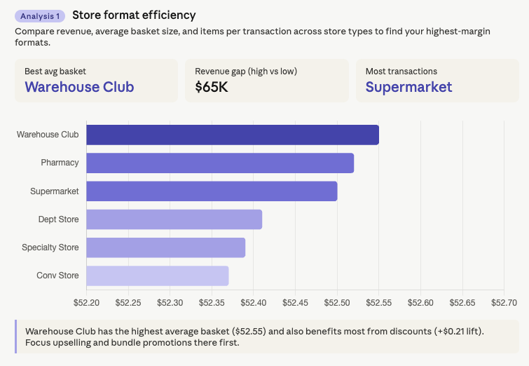
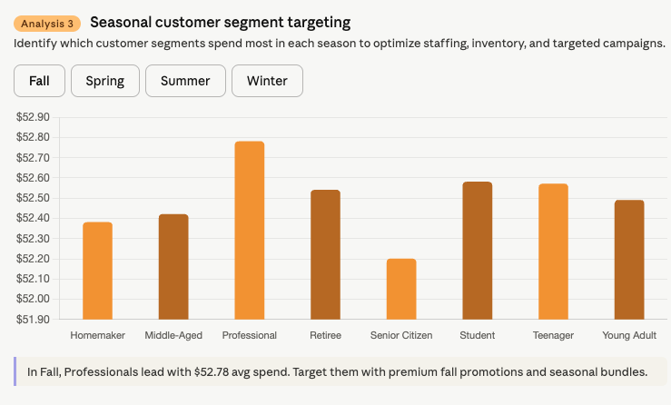

# วิเคราะห์ข้อมูลด้วย AI

อัปโหลดไฟล์ข้อมูล → พิมพ์ prompt เดียว → ได้ dashboard แบบ interactive ทันที ไม่ต้องเขียน code ไม่ต้องรอทีม IT

---

## ตัวอย่างจริง — Claude

เราจะใช้ข้อมูล retail purchase จาก [Kaggle](https://www.kaggle.com/datasets/prasad22/retail-transactions-dataset) สามารถดาวน์โหลดมาเล่นได้เลยค่ะ

อัปโหลดไฟล์ข้อมูลธุรกรรมร้านค้า แล้วใช้ prompt นี้:

```prompt
I have a retail transaction dataset with columns: Transaction_ID, Date,
Customer_Name, Product_Category, Quantity, Unit_Price, Total_Price,
Payment_Method, City, Store_Type, and Discount_Applied.

I want to optimize my store operations. Please think step-by-step: What
are the top 3 analyses I should perform to increase my profit margin?
Suggest the specific charts I should create for each analysis.
```

Claude รันโค้ดเอง วิเคราะห์เอง แล้วสร้าง interactive dashboard ให้คลิกดูได้เลย

[ดูตัวอย่างผลลัพธ์จริง →](https://claude.ai/share/95df7400-6270-4218-801f-ae1e0700c3ea)

---


!!! warning "ก่อนอัปโหลดข้อมูลจริง"
    ห้ามอัปโหลดข้อมูลที่มีชื่อลูกค้า เลขบัตรประชาชน หรือข้อมูลส่วนตัว — ให้ลบคอลัมน์ sensitive ออกก่อน หรือใช้ข้อมูลตัวอย่างในการฝึก
    
!!! warning "ค่าใช้จ่าย"
    ทั้ง Claude และ Google AI Studio สามารถทำงานแบบ Data Analytics ได้ดีมาก แต่ก็ยังเป็นงานที่ค่อนข้างเปลือง tokens อาจจะต้องมีงบประมาณซัพพอร์ทหากจะทำเป็นประจำ

---

??? note "ภาพตัวอย่างผลลัพธ์จาก Claude (สำรอง)"

    <div class="ac-gallery ac-gallery-large">
      
    </div>

    <div class="ac-gallery ac-gallery-large">
      
    </div>

    <div class="ac-gallery ac-gallery-large">
      
    </div>

    <div class="ac-gallery ac-gallery-large">
      
    </div>
