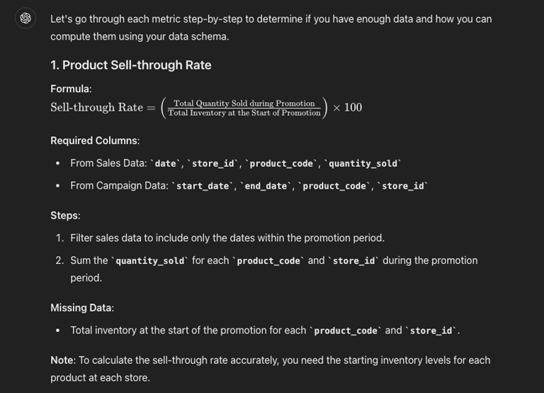

# วิเคราะห์ข้อมูลด้วย AI

แบบฝึกหัดนี้จะสาธิตความสามารถและข้อจำกัดในการทำ Data Analytics ใน ChatGPT

## 👩🏻‍💼 สถานการณ์สมมติ
คุณเป็นผู้จัดการที่ต้องวิเคราะห์ข้อมูลให้กับองค์กรของคุณอยู่เสมอ คุณต้องออกแบบการวัดผลงานของทีม และนำเสนอในรูปแบบ Dashboard ต่อผู้บริหาร เพื่อจูงใจให้ผู้บริหารยอมรับการปรับกลยุทธ์การขาย AI จะช่วยคุณในสถานการณ์นี้อย่างไร?

## Using ChatGPT to Plan Your Analytics

ChatGPT สามารถช่วยเราวางแผนการทำ dashboard ตั้งแต่ในสเต็ปของการวางแผน เตรียมข้อมูล และออกแบบ measurements ให้กับธุรกิจของเรา

```prompt
I'm a Marketing Operations Manager a large company, overseeing the marketing initiatives for our convenient stores located all around the country. We want to create a dashboard to help us track and optimize our promotional campaigns. Here are some data we have:

1. Sales Data: Daily and weekly sales figures segmented by product code and store location.
2. Campaign Data: Information on current and past promotional campaigns, including details about discount coupons, loyalty points offers, start data and end date of the promotion linked to sales data by product code and store location.
3. Redemption Data: Information about the number of coupons or loyalty points redeemed on specific product code and store location.

---

Please think through it step-by-step. What key performance indicators (KPIs) should we ideally track to measure the success of our promotional campaigns at 7-Eleven stores?
```

??? note "Response I got"
    To measure the success of promotional campaigns at 7-Eleven stores, you should track the following key performance indicators (KPIs):
    
    1. Sales Growth: Measure the increase in sales during the promotional period compared to a baseline period. This can be tracked daily and weekly by product code and store location.
    2. Redemption Rate: Calculate the percentage of issued coupons or loyalty points that are redeemed. This helps to understand the effectiveness of the promotional offers.
    3. Average Transaction Value (ATV): Monitor the average amount spent per transaction during the promotion. Compare this with the ATV before the promotion to see if customers are spending more.
    4. Customer Footfall: Track the number of customers visiting the stores during the promotion. An increase in footfall can indicate the promotion's attractiveness.
    5. Product Sell-through Rate: Measure the percentage of inventory sold during the promotion period. This helps to understand how well the promoted products are performing.
    6. Gross Margin: Evaluate the profit margin on sales during the promotion, considering the cost of discounts and any additional marketing expenses.
    7. Promotion Uplift: Assess the additional sales generated due to the promotion. This can be calculated by comparing sales of promoted products during the promotion to the sales in a comparable period without promotion.
    8. Customer Retention Rate: Track how many customers return to the store after participating in the promotion. This helps to understand if the promotion helps in building long-term customer loyalty.
    9. Basket Size: Measure the number of items per transaction. Promotions might encourage customers to buy more items per visit.
    10. Campaign ROI (Return on Investment): Calculate the financial return of the promotion compared to the costs associated with running it. This includes the cost of discounts, marketing expenses, and any operational costs.
    11. Conversion Rate: For digital or targeted campaigns, track the percentage of customers who responded to the promotion (e.g., via email or app notifications) and made a purchase.
    12. Customer Acquisition Cost (CAC): If the promotion targets new customers, measure the cost to acquire each new customer through the promotion.
    13. Churn Rate: For loyalty points promotions, measure the rate at which customers stop participating in the loyalty program before and after the promotion.

By tracking these KPIs, you can gain insights into the effectiveness of your promotional campaigns and identify areas for improvement to optimize future campaigns.

```prompt
Here's my data schema:

### Sales Data

1. **sale_id**: INT - Unique identifier for each sale record.
2. **date**: DATE - Date of the sale.
3. **week_number**: INT - Week number of the sale.
4. **store_id**: INT - Identifier for the store location.
5. **product_code**: VARCHAR(20) - Unique code for the product.
6. **quantity_sold**: INT - Number of units sold.
7. **total_sales**: DECIMAL(10,2) - Total sales amount.

### Campaign Data

1. **campaign_id**: INT - Unique identifier for each campaign.
2. **campaign_name**: VARCHAR(100) - Name of the promotional campaign.
3. **start_date**: DATE - Start date of the campaign.
4. **end_date**: DATE - End date of the campaign.
5. **discount_coupon**: VARCHAR(20) - Code for the discount coupon, if applicable.
6. **loyalty_points**: INT - Loyalty points offered during the campaign.
7. **product_code**: VARCHAR(20) - Unique code for the product involved.
8. **store_id**: INT - Identifier for the store location.

### Redemption Data (with Customer Data)

1. **redemption_id**: INT - Unique identifier for each redemption record.
2. **date**: DATE - Date of redemption.
3. **store_id**: INT - Identifier for the store location.
4. **product_code**: VARCHAR(20) - Unique code for the product redeemed.
5. **coupon_code**: VARCHAR(20) - Code for the coupon used, if applicable.
6. **loyalty_points**: INT - Loyalty points redeemed.
7. **customer_id**: INT - Unique identifier for the customer.
8. **membership_status**: VARCHAR(20) - Membership status of the customer (e.g., Gold, Silver, Bronze).

I'm interested in the following metrics:
1. Product Sell-through Rate: Measure the units of inventory sold during the promotion period. This helps to understand how well the promoted products are sold through.
2. Promotion Uplift: Assess the additional sales generated due to the promotion. This can be calculated by comparing gross sales of promoted products during the promotion to the sales in a comparable period without promotion.
3. Campaign ROI (Return on Investment): Calculate the financial return of the promotion compared to the costs associated with running it. This includes the cost of discounts, marketing expenses, and any operational costs.

Do I have enough data to measure these metrics? Please think through it step-by-step. For each metrics explain formula for computation and mention the columns you will use to calculate the metrics. If we miss data, please tell me what data are missing.
```



??? note "Response I got"

    Let's go through each metric step-by-step to determine if you have enough data and how you can compute them using your data schema.

    #### 1. Product Sell-through Rate
    
    **Formula**: \[ \\text{Sell-through Rate} = \\left( \\frac{\\text{Total Quantity Sold during Promotion}}{\\text{Total Inventory at the Start of Promotion}} \\right) \\times 100 \]
    
    **Required Columns**:
    
    *   From Sales Data: `date`, `store_id`, `product_code`, `quantity_sold`
    *   From Campaign Data: `start_date`, `end_date`, `product_code`, `store_id`
        
    
    **Steps**:
    
    1.  Filter sales data to include only the dates within the promotion period.
    2.  Sum the `quantity_sold` for each `product_code` and `store_id` during the promotion period.
        
    
    **Missing Data**:
    
    *   Total inventory at the start of the promotion for each `product_code` and `store_id`.
        
    
    **Note**: To calculate the sell-through rate accurately, you need the starting inventory levels for each product at each store.
    
    #### 2. Promotion Uplift
    
    **Formula**: \[ \\text{Promotion Uplift} = \\left( \\frac{\\text{Total Sales during Promotion} - \\text{Total Sales in Comparable Period}}{\\text{Total Sales in Comparable Period}} \\right) \\times 100 \]
    
    **Required Columns**:
    
    *   From Sales Data: `date`, `store_id`, `product_code`, `total_sales`
    *   From Campaign Data: `start_date`, `end_date`, `product_code`, `store_id`
        
    
    **Steps**:
    
    1.  Filter sales data for the promotion period and the comparable period (e.g., same length of time immediately before the promotion or same period in the previous year).
    2.  Sum the `total_sales` for each `product_code` and `store_id` during both periods.
    3.  Compute the uplift using the formula.
        
    
    **Note**: Ensure that the comparable period is appropriately selected to avoid seasonal variations.
    
    #### 3. Campaign ROI (Return on Investment)
    
    **Formula**: \[ \\text{Campaign ROI} = \\left( \\frac{\\text{Net Profit from Campaign} - \\text{Cost of Campaign}}{\\text{Cost of Campaign}} \\right) \\times 100 \]
    
    **Required Columns**:
    
    *   From Sales Data: `date`, `store_id`, `product_code`, `total_sales`
    *   From Campaign Data: `start_date`, `end_date`, `discount_coupon`, `loyalty_points`, `product_code`, `store_id`
    
    **Additional Data Needed**:
    
    *   Cost of discounts (can be derived from `discount_coupon` if value per coupon is known).
    *   Cost of loyalty points (can be derived from `loyalty_points` if value per point is known).
    *   Marketing expenses.
    *   Operational costs.
    
    **Steps**:
    
    1.  Calculate the total revenue generated during the campaign period from `total_sales`.
    2.  Estimate the cost of discounts and loyalty points redeemed using the redemption data.
    3.  Subtract the campaign costs (discounts, loyalty points, marketing, operational) from the total revenue to get the net profit.
    4.  Calculate ROI using the formula.
    
    **Missing Data**:
    
    *   Exact value of discounts associated with `discount_coupon`.
    *   Value of `loyalty_points`.
    *   Marketing expenses and operational costs associated with each campaign.
    
    #### Summary
    
    **Data You Have**:
    
    *   Sales figures (daily and weekly) segmented by product and store location.
    *   Campaign details including start and end dates, product codes, and store locations.
    *   Redemption data including coupons and loyalty points used.
        
    **Data You Need**:
    
    *   Starting inventory levels for calculating the sell-through rate.
    *   Values associated with discount coupons and loyalty points.
    *   Marketing and operational costs for calculating the ROI.
        
    With the available data and some additional data on inventory levels, coupon values, loyalty points values, and campaign costs, you will be able to measure the required metrics accurately.

ChatGPT ยังตอบผิดอยู่บ้าง เช่น ตรง Campaign ROI สูตรผิด แต่ก็ทำให้เราเห็นถึงช่องโหว่ของข้อมูลของเราที่คิดไม่ถึง และเขียนสูตรออกมาให้เราตรวจสอบและตัดสินใจได้เร็วกว่าการมานั่งร่างสูตรด้วยตัวเองโดยไม่มีผู้ช่วย หรือเสิชหาสูตรจากอินเตอร์เน็ตทีละอัน ถ้าสูตรไม่ถูกต้องเราสามารถบอกให้ ChatGPT แก้ไขได้


## Dashboard Designs

การจะสร้าง dashboard ขึ้นมาเราอาจจะต้องคำนึงถึงคนที่จะดูข้อมูลจาก dashboard นี้ (เช่น ผู้บริหาร) และอาจจะต้องมีความคิดสร้างสรรค์ว่าจะสร้าง dashboard อย่างไรให้ตรงใจ อาจจะใช้ prompt ต่อไปนี้

```prompt
My boss is often worried about the overall impact and efficiency of our promotional campaigns. She has talked about the following concerns.

1. Campaign & Customer Interaction: She wants to know if the campaigns are reaching the right audience and if the customers who engage with the promotions are also the ones contributing significantly to our sales.

2. Customer Retention: She is interested in understanding whether the promotions are helping to retain existing customers and attract new ones. Are we seeing an increase in repeat purchases from customers who used the coupons or loyalty points?

Can you design the dashboard to address her concerns. Please visualize a perfect dashboard for my boss panel-by-panel. In each panel, please list all the metrics and provide a description of how these metrics can be computed. What data are needed to compute them.
```

??? note "Response I got"

    To design a comprehensive dashboard that addresses your boss's concerns, we can create multiple panels, each focusing on a specific aspect of the promotional campaigns. Here’s a visualization of the perfect dashboard, panel-by-panel, with the relevant metrics, descriptions, and data requirements.
    
    ### Panel 1: Campaign & Customer Interaction
    
    **Metrics:**
    
    1.  **Customer Reach**:
        
        *   **Description**: Measures the number of unique customers who engaged with the promotion (used a coupon or loyalty points).
        *   **Computation**: Count of unique `customer_id` in `Redemption Data`.
        *   **Data Needed**: `customer_id`, `coupon_code`, `loyalty_points`.
            
    2.  **Customer Contribution to Sales**:
        
        *   **Description**: Total sales attributed to customers who engaged with the promotions.
        *   **Computation**: Sum of `total_sales` for sales records where `customer_id` is found in `Redemption Data`.
        *   **Data Needed**: `customer_id`, `total_sales`.
            
    3.  **Engagement Rate**:
        
        *   **Description**: Percentage of total customers who engaged with the promotion.
        *   **Computation**: (\\frac{\\text{Unique Customers Engaged}}{\\text{Total Customers}} \\times 100)
        *   **Data Needed**: `customer_id` in both Sales and Redemption Data.
            
    **Visualization:**
    
    *   Bar chart showing the number of engaged customers per campaign.
    *   Pie chart representing the proportion of sales contributed by engaged customers.
    *   Line chart tracking engagement rate over different campaigns.
        
    
    ### Panel 2: Customer Retention
    
    **Metrics:**
    
    1.  **Repeat Purchase Rate**:
        
        *   **Description**: Percentage of customers who made repeat purchases after engaging with the promotion.
        *   **Computation**: (\\frac{\\text{Customers with Repeat Purchases}}{\\text{Total Customers Engaged}} \\times 100)
        *   **Data Needed**: `customer_id`, `date`.
            
    2.  **New vs. Returning Customers**:
        
        *   **Description**: Number of new customers versus returning customers engaging with the promotion.
        *   **Computation**: Count of new `customer_id` (first-time buyers) and returning `customer_id`.
        *   **Data Needed**: `customer_id`, `date`.
            
    3.  **Customer Lifetime Value (CLV)**:
        
        *   **Description**: Predicted net profit attributed to the entire future relationship with a customer.
        *   **Computation**: CLV formula considering `total_sales` and frequency of purchases.
        *   **Data Needed**: `customer_id`, `total_sales`, `date`.
            
    **Visualization:**
    
    *   Bar chart showing the number of repeat vs. one-time purchases.   
    *   Stacked bar chart comparing new vs. returning customers.
    *   Line graph showing trends in Customer Lifetime Value over time.
        
    ### Panel 3: Campaign Analysis (Why Campaigns Work or Fail)
    
    **Metrics:**
    
    1.  **Sales Uplift**:
        
        *   **Description**: Additional sales generated due to the campaign. 
        *   **Computation**: (\\text{Sales During Campaign} - \\text{Baseline Sales})
        *   **Data Needed**: `total_sales`, `date`, `start_date`, `end_date`.
            
    2.  **Customer Feedback** (if available):
        
        *   **Description**: Qualitative data on customer satisfaction and feedback regarding the promotions.
        *   **Computation**: Analysis of survey or feedback data.
        *   **Data Needed**: Customer survey or feedback forms.
            
    3.  **Promotion Cost Analysis**:
        
        *   **Description**: Total cost of running the promotion including discounts, loyalty points, marketing, and operational costs.
        *   **Computation**: Sum of all costs associated with the promotion.
        *   **Data Needed**: Cost per coupon, monetary value per loyalty point, marketing expenses, operational costs.
            
    4.  **Conversion Rate**:
        
        *   **Description**: Percentage of customers who made a purchase after seeing the promotion.
        *   **Computation**: (\\frac{\\text{Customers who Purchased}}{\\text{Customers who Viewed Promotion}} \\times 100)
        *   **Data Needed**: `customer_id`, `campaign_id`, interaction data (views/clicks if available).
    
    **Visualization:**
    
    *   Comparative bar chart showing sales uplift for different campaigns.
    *   Pie chart displaying the distribution of campaign costs.
    *   Line chart indicating conversion rates across various campaigns.
        
    ### Panel 4: Overall Impact and Efficiency
    
    **Metrics:**
    
    1.  **ROI (Return on Investment)**:
        
        *   **Description**: Financial return of the promotion compared to the costs associated.
        *   **Computation**: (\\frac{\\text{Net Profit}}{\\text{Total Cost}} \\times 100)
        *   **Data Needed**: `total_sales`, campaign costs.
            
    2.  **Overall Campaign Performance**:
        
        *   **Description**: Aggregate performance metrics of all campaigns.
        *   **Computation**: Summary statistics (mean, median, total) for sales uplift, engagement rate, repeat purchase rate, etc.
        *   **Data Needed**: All relevant metrics data.
            
    3.  **Trend Analysis**:
        
        *   **Description**: Trends in key metrics over time to identify patterns.
        *   **Computation**: Time-series analysis of sales, engagement, retention, etc.
        *   **Data Needed**: Time-stamped data for all metrics.
    
    **Visualization:**
    
    *   KPI dashboard with summary metrics.
    *   Heatmap showing performance metrics across different stores and campaigns.
    *   Time-series line charts showing trends in key metrics.
        
    ### Summary
    
    By creating panels focused on Campaign & Customer Interaction, Customer Retention, Campaign Analysis, and Overall Impact and Efficiency, the dashboard will provide a holistic view of the promotional campaigns' performance. Each panel will utilize specific metrics calculated from the given data and additional data where necessary to provide actionable insights into campaign effectiveness and areas for improvement.
    

เราอาจจะใช้ ChatGPT เพื่อเพิ่มความกระจ่างในปัญหาที่ผู้บริหารสงสัย แต่เราไม่แน่ใจว่าจะตอบคำถามได้อย่างไรด้วยข้อมูล เช่น 

```prompt
My boss is often worried Why Campaigns Work or Fail: She wants data to inform us why some campaigns fly and some campaigns fail.

In a retail store like 7-Eleven, what determines the success or failure of a coupon campaign? What analytic angle should we look into to answer the above question?
```

??? note "Response I got"

    In a retail store like 7-Eleven, the success or failure of a coupon campaign can be influenced by various factors. To determine these, it's essential to analyze the campaign from multiple angles. Here are some key factors and the corresponding analytics angles to consider:
    
    1.  **Target Audience Alignment:**
        
        *   **Customer Segmentation Analysis:** Assess whether the coupons were distributed to the right customer segments. Look at demographic data, purchasing behavior, and loyalty program participation to see if the targeted audience aligns with the customers who actually redeemed the coupons.
            
    2.  **Timing and Duration:**
        
        *   **Sales Trend Analysis:** Evaluate sales patterns before, during, and after the campaign. Compare these with historical data to understand the timing's impact. Analyze if the campaign coincided with seasonal trends, holidays, or other significant events.
            
    3.  **Promotion Awareness:**
        
        *   **Marketing Channel Effectiveness:** Analyze the performance of different marketing channels (e.g., social media, email, in-store promotions). Look at metrics like reach, engagement, and conversion rates to determine how well the promotion was communicated to potential customers.
            
    4.  **Offer Attractiveness:**
        
        *   **Redemption Rates:** Measure the percentage of distributed coupons that were redeemed. High redemption rates indicate that the offer was appealing, while low rates may suggest that the discount or incentive was not compelling enough.
            
        *   **Customer Feedback and Surveys:** Collect and analyze feedback from customers to understand their perceptions of the offer's value.
            
    5.  **Product Selection:**
        
        *   **Product Performance Analysis:** Examine the sales data for the specific products included in the promotion. Determine if the promoted products were popular or had a high turnover rate before the campaign. Analyze inventory levels to ensure the products were sufficiently stocked.
            
    6.  **In-Store Execution:**
        
        *   **Store Compliance Checks:** Evaluate how well the campaign was executed in stores. Check if the promotional materials were displayed correctly and if staff were informed and motivated to promote the campaign. This can be done through store audits or mystery shopper reports.
            
    7.  **Competitive Landscape:**
        
        *   **Market Benchmarking:** Compare the campaign's performance against similar promotions run by competitors. This can provide insights into whether external factors, like competitor offers, influenced the campaign's success or failure.
            
    8.  **Pricing Strategy:**
        
        *   **Price Sensitivity Analysis:** Assess how price changes influenced customer behavior. Determine if the discount provided was significant enough to drive purchases without eroding profit margins.
            
    9.  **Operational Efficiency:**
        
        *   **Logistics and Supply Chain Analysis:** Evaluate if there were any logistical issues that affected the campaign, such as stockouts or delayed shipments. Ensure that the supply chain was prepared to handle the increased demand generated by the promotion.
    
    By examining these factors and analytics angles, you can gain a comprehensive understanding of why certain coupon campaigns succeed while others fail. This will enable you to optimize future campaigns and make data-driven decisions to enhance their effectiveness.


```prompt
If I want to calculate how much of the campaign performance is lost due to inventory shortage, what metrics should be calculated and what data are needed?
```

??? note "Response I got"

    To calculate how much of the campaign performance is lost due to inventory shortage, you will need to analyze several metrics and gather specific data. Here’s a structured approach to accomplish this:
    
    ### Key Metrics to Calculate:
    
    1.  **Stockout Rate:**
        
        *   The percentage of time during the campaign period when the promoted products were out of stock.
            
    2.  **Lost Sales Due to Stockouts:**
        
        *   The estimated sales that were lost because the products were not available when customers wanted to purchase them.
            
    3.  **Unfulfilled Demand:**
        
        *   The difference between the potential demand (based on normal and campaign-influenced demand) and the actual sales due to inventory shortages.
            
    4.  **Customer Satisfaction Impact:**
        
        *   Indirect metric, often measured through customer feedback, indicating how stockouts affected customer satisfaction and future purchasing behavior.
            
    ### Data Needed:
    
    1.  **Sales Data:**
        
        *   Daily and weekly sales figures segmented by product code and store location.    
        *   Historical sales data for the same products and locations for baseline comparisons.
            
    2.  **Inventory Data:**
        
        *   Daily inventory levels for each promoted product at each store location.
        *   Records of stock replenishment dates and quantities.
            
    3.  **Campaign Data:**
        
        *   Details of the promotional campaign, including start and end dates, promoted product codes, and expected uplift in demand.
            
    4.  **Customer Data (Optional):**
        
        *   Customer feedback or complaints related to stockouts.
        *   Purchase intent data if available (e.g., items added to online shopping carts but not purchased due to unavailability).
            
    ### Steps to Calculate Metrics:
    
    1.  **Calculate Stockout Rate:**
        
        *   **Formula:** Stockout Rate = (Days Out of Stock / Total Campaign Days) \* 100
        *   **Data Required:** Daily inventory levels for each product during the campaign period.
            
        
    2.  **Estimate Lost Sales Due to Stockouts:**
        
        *   **Step 1:** Identify days when stockouts occurred for each product.
        *   **Step 2:** Calculate the average daily sales of the promoted products before the stockout period.
        *   **Step 3:** Estimate potential sales during the stockout period by multiplying the average daily sales by the number of stockout days.
        *   **Formula:** Lost Sales = Average Daily Sales \* Stockout Days
        *   **Data Required:** Historical sales data, daily sales data during the campaign, and stockout days.
            
        
    3.  **Determine Unfulfilled Demand:**
        
        *   **Step 1:** Calculate expected demand based on the promotional uplift (compare campaign period sales to a comparable period without the promotion).
        *   **Step 2:** Subtract actual sales (considering stockouts) from the expected demand.
        *   **Formula:** Unfulfilled Demand = Expected Demand - Actual Sales
        *   **Data Required:** Sales data during and before the campaign, expected uplift percentage.
            
        
    4.  **Analyze Customer Satisfaction Impact (Optional):**
        
        *   **Step 1:** Gather customer feedback or complaints related to product availability.
        *   **Step 2:** Analyze the feedback to quantify dissatisfaction related to stockouts.
        *   **Data Required:** Customer feedback, surveys, complaint logs.
            
        
    
    ### Example Calculation:
    
    1.  **Stockout Rate Calculation:**
        
        *   If a product was out of stock for 5 days during a 30-day campaign: Stockout Rate = (5 / 30) \* 100 = 16.67%
            
    2.  **Lost Sales Due to Stockouts:**
        
        *   If the average daily sales of the product were 100 units, and the product was out of stock for 5 days: Lost Sales = 100 units/day \* 5 days = 500 units
            
        
    3.  **Unfulfilled Demand:**
        
        *   If the expected demand (based on the promotional uplift) was 4000 units, but actual sales were 3500 units due to stockouts: Unfulfilled Demand = 4000 units - 3500 units = 500 units
            
    By calculating these metrics, you can quantify the impact of inventory shortages on your campaign performance. This analysis will help you understand the lost sales opportunities and make informed decisions to improve inventory management for future campaigns.

    
## Data Understanding with ChatGPT

แบบฝึกหัดต่อไปเราจะลองใช้ ChatGPT เพื่อทำความเข้าใจข้อมูลที่เราได้รับมา

Note: ฟังก์ชันที่จะโชว์ต่อไปนี้มีแต่ใน ChatGPT Paid Plan เท่านั้น เมื่อเร็วๆนี้ ChatGPT ประกาศว่ากำลังเร่งพัฒนาฟีเจอร์ใหม่ที่ใช้เพื่อการทำ data analytics โดยเฉพาะ

เราจะใช้ข้อมูล retail purchase จาก [Kaggle](https://www.kaggle.com/datasets/prasad22/retail-transactions-dataset) ที่ถูกลดทอนให้สั้นเหลือ 250 แถวเพื่อการทดลอง สามารถดาวน์โหลดมาเล่นได้เลยค่ะ

??? note "ตัวอย่างการ describe และ visualize ข้อมูล"
    [https://chatgpt.com/share/6802e81d-31e0-8011-a148-594f9e8ae8ed](https://chatgpt.com/share/6802e81d-31e0-8011-a148-594f9e8ae8ed)

??? note "ตัวอย่างการวิเคราะห์ข้อมูลเพื่อตอบคำถาม"
    [https://chatgpt.com/share/8d5aea7a-87e4-4e0a-b949-7e6b5f138347](https://chatgpt.com/share/8d5aea7a-87e4-4e0a-b949-7e6b5f138347)
    
    
## Cautions:
### ChatGPT is not a data analytic tool.

* Generative AI โดยทั่วไปเป็นได้เพียงผู้ช่วยให้ data scientist/data analyst ทำงานแต่ละสเต็ปได้ง่ายขึ้น เอไอไม่สามารถทำการวิเคราะห์ข้อมูลแทนผู้เชี่ยวชาญได้ในขณะนี้ 

* สำหรับผู้เชี่ยวชาญด้านการวิเคราะห์ข้อมูล ChatGPT เป็นเครื่องมือที่ใช้ค่อนข้างยาก เพราะโค้ดที่เขียนออกมาอาจจะผิดหรือไม่ถูกหลักการการจัดการข้อมูลทุกครั้ง ต้องสั่งให้ทำใหม่ ไม่สามารถปรับเปลี่ยนข้อมูล (data wrangling) ได้ตามใจ  บ่อยครั้งอาจจะต้องก๊อปโค้ดไปแก้และรันข้างนอกเพื่อให้ได้ผลลัพธ์ที่ต้องการ แต่ถ้าเป็นงานวิเคราะห์หรือสร้างกราฟที่ไม่ซับซ้อนมากจะเร็วกว่าทำเอง (ใน BI Software เช่น Tableau เราสามารถสั่งเอไอทำแล้วถ้าผลลัพธ์ออกมาไม่ถูกก็สามารถแก้ไขได้เลยในหน้าเดียวกัน เป็นประสบการณ์ผู้ใช้ที่ดีกว่า)

* สิ่งที่ ChatGPT หรือ Generative AI ทำออกมามีโอกาสผิด (เช่นเดียวกับมนุษย์ทั่วไป) เช่น ChatGPT อาจจะคำนวณค่าเฉลี่ย ค่าสูงสุด ต่ำสุดออกมาผิด ซึ่งอาจจะเกิดจาก hallucination และความสามารถที่ยังจำกัด และจะยิ่งเป็นมากในกรณีที่ได้รับ prompt ที่กำกวม จึงต้องตรวจสอบโค้ดที่เขียนออกมาเสมอว่าเขียนฟังก์ชันวิเคราะห์ข้อมูลถูกหรือไม่ 

* ChatGPT ไม่ได้ถูกออกแบบมาให้วิเคราะห์ข้อมูลขนาดใหญ่จึงมีข้อจำกัดเรื่องไซส์ของข้อมูลที่จะอัพโหลดขึ้นไป (ไม่เกิน 50 MB สำหรับ csv file) สามารถศึกษาข้อจำกัดนี้ได้ในลิงค์นี้ [link](https://help.openai.com/en/articles/8555545-file-uploads-faq)