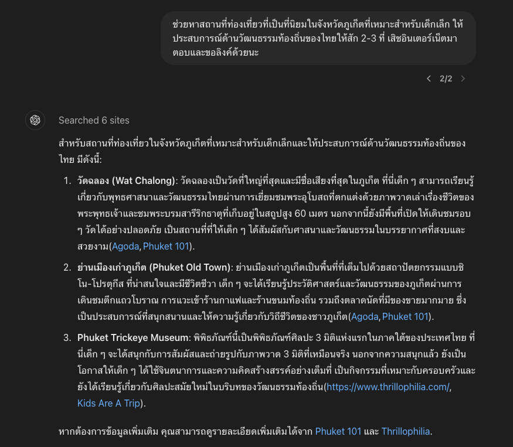

# สื่อสารภาษาอังกฤษอย่างมืออาชีพด้วย AI

## 👩🏻‍💼 สถานการณ์สมมติ
คุณเป็นเจ้าของโรงแรมระดับ 5 ดาวในภูเก็ต พนักงานต้อนรับของคุณต้องตอบอีเมลจากลูกค้าชาวอเมริกันที่สนใจจะมาพักที่โรงแรมของคุณในช่วงวันหยุดยาว พนักงานจะใช้ ChatGPT ช่วยร่างอีเมลตอบกลับที่ครอบคลุม สุภาพ และเป็นมืออาชีพได้อย่างไร

## 🚀 อ่านอีเมลจากลูกค้าให้เข้าใจ

สมมติว่ามีนักท่องเที่ยวชาวอเมริกัน ติดต่อมาซักถามเรื่องบริการของโรงแรม ก่อนอื่นเราอาจจะสอนให้พนักงานวิเคราะห์อีเมลของลูกค้าก่อนว่าเขาต้องการทราบอะไร จะได้ตอบได้ครบถ้วน

```prompt
ช่วยวิเคราะห์อีเมลนี้และระบุประเด็นสำคัญที่ลูกค้าต้องการทราบเป็นข้อๆ ตอบเป็นภาษาไทย

---

Hello,

I hope this message finds you well. My name is Sarah, and I'm planning a family trip to Phuket in December. We're looking to stay at a 5-star hotel that offers both luxury and convenience for our family of four.

I came across your hotel, and it looks absolutely stunning! We’re considering a stay of at least 10 days, and I wanted to inquire about any special promotions or discounts you might offer for longer stays. Additionally, we’re interested in exploring the area and would love to know more about the package tours or activities your hotel can arrange for families, especially ones that offer cultural experiences and are suitable for young children.

Lastly, could you also provide information about any dining options you have on-site, particularly if you offer any special dietary accommodations? We have a mix of dietary preferences in our family, so it would be great to know what’s available.

Thank you so much for your assistance. We’re very much looking forward to our trip.

Best regards,
Sarah
```

??? note "ตัวอย่างคำตอบ"
    จากการวิเคราะห์อีเมลนี้ ประเด็นสำคัญที่ลูกค้าต้องการทราบมีดังนี้:
    
    1. โปรโมชั่นหรือส่วนลดสำหรับการเข้าพักระยะยาว (อย่างน้อย 10 วัน) ในโรงแรมระดับ 5 ดาว
    2. แพ็คเกจทัวร์หรือกิจกรรมที่โรงแรมสามารถจัดให้สำหรับครอบครัว โดยเฉพาะกิจกรรมที่:
        - ให้ประสบการณ์ทางวัฒนธรรม
        - เหมาะสำหรับเด็กเล็ก
    3. ข้อมูลเกี่ยวกับตัวเลือกร้านอาหารภายในโรงแรม โดยเฉพาะ:
        - ความสามารถในการรองรับความต้องการด้านอาหารพิเศษ
        - ตัวเลือกอาหารที่หลากหลายสำหรับครอบครัวที่มีความชอบด้านอาหารที่แตกต่างกัน
    4. รายละเอียดเกี่ยวกับสิ่งอำนวยความสะดวกและบริการที่เหมาะสำหรับครอบครัว 4 คน
    5. ข้อมูลทั่วไปเกี่ยวกับการท่องเที่ยวในพื้นที่ภูเก็ตและบริเวณใกล้เคียง
    
## 🚀 ปรึกษา AI ว่าตอบอย่างไรดี

ถึงแม้จะเข้าใจแล้วว่าลูกค้าต้องการอะไร พนักงานต้อนรับก็อาจจะยังตอบไม่ได้ อาจจะเพราะเขาไม่ทราบคำตอบ หรืออาจจะทราบ แต่ไม่รู้จะอธิบายอย่างไร ไม่เป็นไร เอไอช่วยได้

```prompt
ในประเด็นของ "โปรโมชั่นหรือส่วนลดสำหรับการเข้าพักระยะยาว (อย่างน้อย 10 วัน)" ฉันไปถามพี่ผู้จัดการแล้ว เขาบอกว่า มีส่วนลด 10% สำหรับห้อง Deluxe Suite ซึ่งฉันคิดว่าน่าจะเหมาะกับลูกค้า เพราะมีพื้นที่เพิ่มเตียงเสริมให้ลูกๆของเขารวม 2 เตียง มีพื้นที่ครัวเล็กๆ และอ่างอาบน้ำขนาดใหญ่ น่าจะทำให้การพักของลูกค้าสะดวกสบายมากขึ้น

ช่วยเขียนตอบลูกค้าเฉพาะประเด็นนี้ก่อน (เขียน 1 ย่อหน้า ยังไม่ต้องใส่ข้อความหัวท้ายของอีเมล) เขียนเป็นภาษาอังกฤษที่แกรมม่าดีเลิศ อย่างกับเขียนโดยพนักงานโรงแรมห้าดาวที่ใช้ภาษาอังกฤษเก่งเหมือนเกิดเมืองนอก
```

??? note "ตัวอย่างคำตอบ"
    We are delighted to inform you that we offer a special 10% discount on our Deluxe Suite for extended stays of 10 days or more. This spacious accommodation is ideal for families, featuring ample room for two additional beds for your children, a cozy kitchenette, and a luxurious oversized bathtub. The Deluxe Suite provides the perfect blend of comfort and convenience, ensuring a memorable and relaxing stay for you and your family. We believe this option will not only meet but exceed your expectations, offering a home-away-from-home experience with all the amenities and services you'd expect from our five-star establishment.
    
สำหรับเรื่องที่พนักงานไม่รู้หรือไม่มีข้อมูล เขาสามารถเสิชหาคำตอบได้ (อาจจะเปิด conversation ใหม่เพื่อมาเสิชหาข้อมูล)

```prompt
ช่วยหาสถานที่ท่องเที่ยวที่เป็นที่นิยมในจังหวัดภูเก็ตที่เหมาะสำหรับเด็กเล็ก ให้ประสบการณ์ด้านวัฒนธรรมท้องถิ่นของไทยให้สัก 2-3 ที่ เสิชอินเตอร์เน็ตมาตอบและขอลิงค์ด้วยนะ
```



```prompt
สำหรับประเด็น "แพ็คเกจทัวร์หรือกิจกรรมที่โรงแรมสามารถจัดให้สำหรับครอบครัว" และ "การท่องเที่ยวในพื้นที่ภูเก็ต" อยากจะตอบแบบนี้

- ทางโรงแรมไม่มีการจัดทัวร์ให้ แต่เรายินดีแนะนำที่ท่องเที่ยวที่เหมาะกับเด็กเล็กได้ เช่น 
    - Phuket Trickeye Museum: พิพิธภัณฑ์นี้เป็นพิพิธภัณฑ์ศิลปะ 3 มิติแห่งแรกในภาคใต้ของประเทศไทย ที่นี่เด็ก ๆ จะได้สนุกกับการสัมผัสและถ่ายรูปกับภาพวาด 3 มิติที่เหมือนจริง 
    - วัดฉลอง (Wat Chalong): วัดฉลองเป็นวัดที่ใหญ่ที่สุดและมีชื่อเสียงที่สุดในภูเก็ต ที่นี่เด็ก ๆ สามารถเรียนรู้เกี่ยวกับพุทธศาสนาและวัฒนธรรมไทยผ่านการเยี่ยมชมพระอุโบสถที่ตกแต่งด้วยภาพวาดเล่าเรื่องชีวิตของพระพุทธเจ้าและชมพระบรมสารีริกธาตุที่เก็บอยู่ในสถูปสูง 60 เมตร นอกจากนี้ยังมีพื้นที่เปิดให้เดินชมรอบ ๆ วัดได้อย่างปลอดภัย 
    - ย่านเมืองเก่าภูเก็ต (Phuket Old Town): ย่านเมืองเก่าภูเก็ตเป็นพื้นที่ที่เต็มไปด้วยสถาปัตยกรรมแบบชิโน-โปรตุกีส ที่น่าสนใจและมีชีวิตชีวา เด็ก ๆ จะได้เรียนรู้ประวัติศาสตร์และวัฒนธรรมของภูเก็ตผ่านการเดินชมตึกแถวโบราณ

ช่วยเขียนตอบลูกค้าเฉพาะประเด็นนี้ (เขียนให้กระชับ อ่านง่าย และน่าสนใจ ยังไม่ต้องใส่ข้อความหัวท้ายของอีเมล) เขียนเป็นภาษาอังกฤษที่แกรมม่าดีเลิศ อย่างกับเขียนโดยพนักงานโรงแรมห้าดาวที่ใช้ภาษาอังกฤษเก่งเหมือนเกิดเมืองนอก
```

??? note "ตัวอย่างคำตอบ"
    While we don't organize package tours directly, we'd be delighted to recommend some family-friendly attractions that offer both cultural experiences and entertainment for young children. Here are a few highlights:
    
    1. Phuket Trickeye Museum: As the first 3D art museum in Southern Thailand, it offers an interactive and fun experience for children, allowing them to touch and take photos with lifelike 3D paintings.
    2. Wat Chalong: Phuket's largest and most famous temple provides an excellent opportunity for children to learn about Thai Buddhism and culture. They can explore the beautifully decorated ubosot (ordination hall) with its paintings depicting Buddha's life, and view the sacred relics housed in the 60-meter-tall stupa. The temple grounds are safe and spacious for families to explore.
    3. Phuket Old Town: This charming area, rich in Sino-Portuguese architecture, offers a vibrant and educational experience. Children can discover Phuket's history and culture while strolling through streets lined with colorful, historic shophouses.

Our concierge team would be more than happy to assist you with detailed information, directions, and even arrange transportation to these attractions, ensuring a memorable and culturally enriching experience for your family.

## 🚀 เมื่อต้องพูดภาษาอังกฤษ ใช้เอไอช่วยเตรียมตัว

```prompt
ฉันกำลังจะไปสัมภาษณ์งานตำแหน่ง Senior Software Developer ที่บริษัท Tech Innovators ซึ่งเป็นบริษัทซอฟต์แวร์ชั้นนำในกรุงเทพฯ ช่วยเตรียมคำตอบสำหรับคำถามสัมภาษณ์ที่อาจเจอ และให้คำแนะนำในการตอบคำถามเป็นภาษาอังกฤษอย่างมั่นใจ โดยคำนึงถึงประเด็นต่อไปนี้:

1. ประสบการณ์ 5 ปีของฉันในการพัฒนาแอปพลิเคชันมือถือทั้ง iOS และ Android
2. ความเชี่ยวชาญใน cloud technologies โดยเฉพาะ AWS และ Google Cloud
3. ผลงานสำคัญ เช่น การพัฒนาแอพที่มีผู้ใช้มากกว่า 1 ล้านคน
4. ความสนใจในโครงการ AI ของบริษัท Tech Innovators
5. ทักษะการทำงานเป็นทีมและการสื่อสาร
6. การจัดการกับความท้าทายในโปรเจ็กต์ที่ผ่านมา
7. วิสัยทัศน์ในการพัฒนาตนเองและเป้าหมายในอาชีพ

กรุณาให้ตัวอย่างคำถามที่อาจเจอในการสัมภาษณ์ พร้อมแนวทางการตอบที่ดี รวมถึงเทคนิคการใช้ภาษาอังกฤษในการสัมภาษณ์ให้ฟังดูเป็นมืออาชีพและน่าประทับใจ นอกจากนี้ ช่วยแนะนำคำถามที่ฉันควรถามบริษัทเกี่ยวกับตำแหน่งงานและวัฒนธรรมองค์กรด้วย"
```

??? note "ตัวอย่างคำตอบ"
    Here are some potential interview questions you might encounter for the Senior Software Developer role at Tech Innovators, along with example answers and tips for responding confidently in English:

    ### 1. Can you tell us about your experience in mobile app development?
    
    Sample Answer: "I have over five years of experience developing mobile applications for both iOS and Android platforms. I’ve worked on various projects that required cross-platform development using technologies like Flutter and native SDKs. One of my most significant achievements was leading a team to develop an app that gained over 1 million users, where I managed both frontend and backend development, ensuring smooth user experience and scalability."

    Tips: Highlight specific projects and results to demonstrate your impact. Be confident in mentioning numbers and successes.

    ### 2. What cloud technologies have you worked with, and how have you applied them in your projects?
    
    Sample Answer: "I specialize in cloud technologies, particularly AWS and Google Cloud. I’ve implemented auto-scaling features, designed cost-efficient architectures, and worked extensively with services like Lambda, EC2, and Firebase. For instance, in my last project, I migrated our backend infrastructure to AWS, reducing downtime and improving system reliability by 30%."

    Tips: Emphasize your technical knowledge of specific cloud platforms and how you’ve used them to solve problems.

    ### 3. Can you describe a challenging project you worked on and how you overcame the challenges?
    
    Sample Answer: "In one project, we faced an unexpected issue with scalability after our user base grew rapidly. To address this, I worked closely with the team to refactor key parts of the codebase and optimize database queries. We also shifted some of the server-side load to AWS Lambda, which improved performance significantly and allowed the app to handle increased traffic without downtime."

    Tips: Focus on your problem-solving process and teamwork in overcoming challenges.

    ### 4. Why are you interested in our AI projects at Tech Innovators?
    
    Sample Answer: "I’m very excited about the AI work being done at Tech Innovators, especially the way you're integrating AI to improve user experiences in software solutions. I’ve always been interested in AI, and I’ve even contributed to a few AI-powered features in mobile apps, such as integrating machine learning models for personalized recommendations. I believe my skills in cloud and mobile development, combined with my interest in AI, would allow me to contribute meaningfully to your team."

    Tips: Show enthusiasm and align your personal interests with the company's projects.

    ### 5. How do you handle working in a team, and how do you communicate effectively with other team members?
    
    Sample Answer: "I believe clear communication and collaboration are key to a successful project. I make it a priority to understand the strengths of each team member and foster an environment where everyone feels comfortable sharing their ideas. I also ensure regular check-ins and use tools like Slack and Jira to keep everyone aligned. In one project, this approach helped us meet tight deadlines while maintaining high quality."

    Tips: Showcase your teamwork and communication skills, mentioning specific tools or strategies.

    ### 6. Where do you see yourself in the next five years, and how do you plan to develop your skills?
    
    Sample Answer: "In the next five years, I aim to continue growing both technically and as a leader. I’m particularly interested in deepening my knowledge of AI and cloud technologies, as well as taking on more responsibilities in leading cross-functional teams. I also want to stay updated with the latest advancements in software development, so I regularly participate in online courses and attend industry conferences."

    Tips: Show ambition and a commitment to continuous learning.

    ### 7. Can you walk us through your approach to managing technical debt in a project?
    
    Sample Answer: "Managing technical debt is crucial for long-term project success. I believe in addressing it incrementally by allocating time during each sprint to refactor and optimize code. This helps ensure we’re not sacrificing long-term maintainability for short-term gains. In one of my projects, we reduced technical debt by 40% within six months by following this approach."

    Tips: Emphasize the balance between delivering features and maintaining clean, sustainable code.

    ### Questions You Should Ask the Company:
    
    1. How does Tech Innovators foster collaboration between teams, especially for cross-functional projects?
    2. This shows your interest in teamwork and how departments collaborate.
    3. What is the company’s vision for integrating AI technologies into its software products over the next few years?
    4. Demonstrates your interest in their AI initiatives and long-term commitment.
    5. What are the biggest challenges your development team is currently facing?
    6. Asking about challenges shows that you’re thinking about how you can add value right away.
    7. How does the company support developers in pursuing continuous learning and skill development?
    8. Highlights your focus on professional growth and learning.
    9. Can you tell me more about the company culture and how the development team interacts with other departments like design or product management?
    10. Shows interest in understanding the workplace dynamics and culture.

    ### Techniques for Confident English Communication:
    
    1. Practice active listening – Listen carefully to the questions and pause briefly before answering. This helps you avoid rushing your answers.
    2. Use structured answers – Follow a clear structure such as the STAR method (Situation, Task, Action, Result) when describing past experiences.
    3. Maintain eye contact and speak clearly – It helps to exude confidence and professionalism.
    4. Avoid filler words – Instead of saying "uhm" or "you know," pause briefly to gather your thoughts.
    5. Tailor your answers – Relate your experiences to how they align with the company's needs. Always end your answers by connecting back to how you can contribute to Tech Innovators.

    By preparing in this structured way, you’ll be able to showcase your expertise, professionalism, and interest in the company. Good luck with your interview!

## 🚀 สรุปวิธีการเขียน prompt ที่ดี (Prompt Engineering 101)
การเป็นเจ้านายที่ดีให้กับเอไอ

1. เป็นเจ้านายที่รู้ว่าตัวเองต้องการอะไร และต้องถามให้ตรงและชัดเจน 
2. เราต้องเข้าใจกระบวนการทำงานที่ถูกต้องก่อน แล้วสั่งเอไอตามกระบวนการ เช่น ขั้นตอนที่ 1 ของการตอบอีเมลคือต้องอ่านอีเมลให้เข้าใจก่อน แล้วจึงจะหาคำตอบทีละประเด็น ถ้าสั่งให้ AI ตอบไปเลย เขาอาจจะตอบไม่ถูกใจ
3. เอไอไม่ได้มีข้อมูลทั้งหมดของเราอยู่ในหัว เราต้องบอกเขา เช่น ต้องบอกเขาก่อนว่าเรามีข้อดีอะไรบ้าง ก่อนจะให้เขาช่วยเรื่องการสัมภาษณ์งาน
4. จะสั่งให้เอไอทำอะไร สุดท้ายคนที่สั่งจะต้องเป็นคนรับผิดชอบผลของงานที่เอไอตอบมา ถ้าตอบผิดพลาด หรือลูกค้าโกรธ คนที่เสียหายคือพนักงานและเจ้าของธุรกิจ ก่อนจะใช้สิ่งที่เอไอบอกมาส่งให้ลูกค้า พนักงานควรอ่านอย่างละเอียดก่อนเสมอ