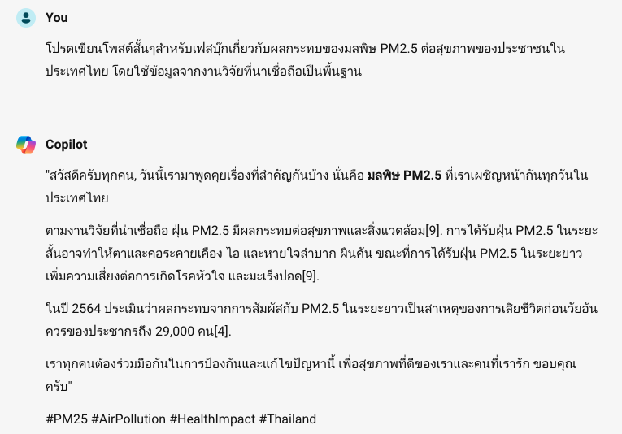
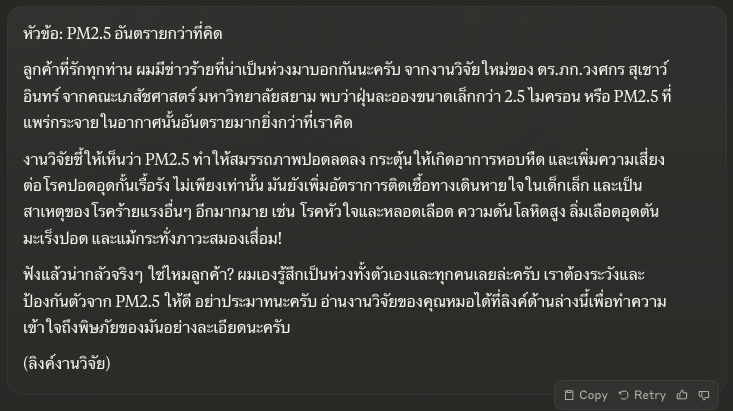
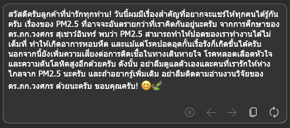
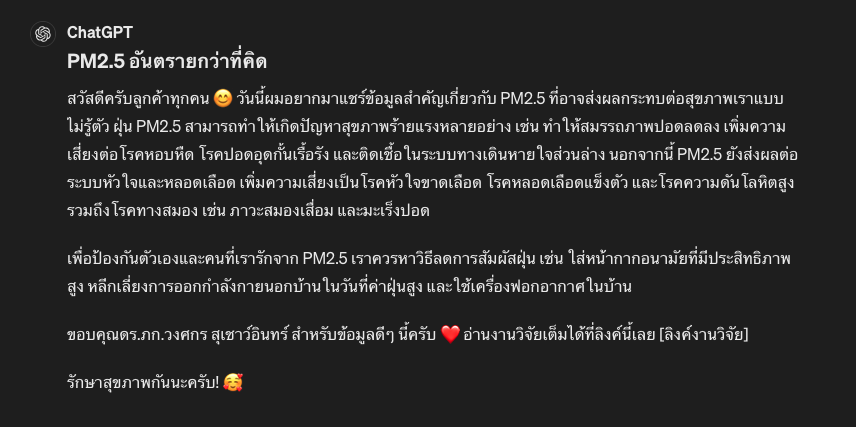
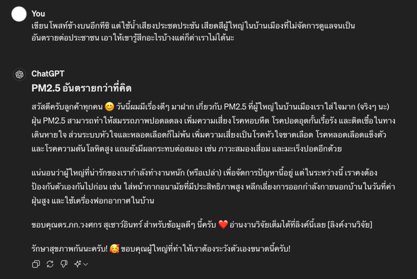

# Using Generative AI to create high-quality social media post

ในแบบฝึกหัดนี้เราจะลองสวมบทบาทเป็นเจ้าหน้าที่ฝ่ายการตลาดที่ได้รับมอบหมายจากหัวหน้าให้เขียนโพสต์เฟสบุ๊กเกี่ยวกับผลกระทบของมลพิษ PM2.5 ต่อสุขภาพคนไทยโดยต้องมีข้อมูลจากงานวิจัยคุณภาพสูงสนับสนุน

---

## Prompting AI the lazy way

หลายคนมักจะเริ่มต้นการใช้ AI ด้วยการเขียน prompt แบบง่ายๆ และคาดหวังว่าจะได้รับผลลัพธ์ที่ดี แต่กลับต้องผิดหวัง ทำให้หลายคนเข้าใจผิดว่า AI ยังไม่ค่อยฉลาดหรือไม่มีประโยชน์

```
โปรดเขียนโพสต์สั้นๆสำหรับเฟสบุ๊กเกี่ยวกับผลกระทบของมลพิษ PM2.5 ต่อสุขภาพของประชาชนในประเทศไทย โดยใช้ข้อมูลจากงานวิจัยที่น่าเชื่อถือเป็นพื้นฐาน
```

### ตัวอย่างผลลัพธ์จาก Copilot



prompt สั้นๆง่ายๆ มักจะให้ผลลัพธ์ที่ไม่ค่อยดี เพราะเอไอไม่ค่อยเข้าใจว่าเราต้องการอะไร และไม่มีแหล่งข้อมูลให้อ้างอิงด้วย จึงมีอาการ hallucinate

เรามาลองดูวิธีการใช้ AI ที่ถูกต้องกัน อาจจะเห็นประโยชน์ของมันชัดเจนขึ้น

ตัวอย่างผลลัพธ์จาก ChatGPT (18 Apr 2025)


---

## Information Gathering

เราต้องคิดก่อนว่าในฐานะเจ้าหน้าที่การตลาด ถ้าเราจะเป็นคนทำงานนี้ด้วยตัวเองและอยากได้ผลลัพธ์คุณภาพสูง เราจะเริ่มอย่างไร ก่อนอื่นเราคงต้องหาข้อมูลที่น่าเชื่อถือก่อนใช่หรือไม่

เราอาจจะเริ่มต้นด้วยการหาข้อมูลและงานวิจัยที่น่าเชื่อถือมาประกอบการเขียนโพสต์ โดยจะใช้คำสั่งต่อไปนี้ในการขอข้อมูลจาก Copilot

> **Try this prompt**

```
ฉันต้องการเขียนเฟสบุคโพสท์คุณภาพสูงที่มีงานวิจัยรองรับเกี่ยวกับ ปัญหามลพิษ PM2.5 ในประเทศไทย โพสท์นี้เป็นโพสท์สั้นๆที่อธิบายถึงผลกระทบของ PM2.5 ต่อสุขภาพของประชาชน ช่วยหาลิงค์ข้อมูลที่ละเอียดเกี่ยวกับปัญหามลพิษ PM2.5 ในประเทศไทย โปรดให้ข้อมูลจากแหล่งที่มาที่น่าเชื่อถือ เช่น รายงานจากองค์กรของรัฐบาล บทความวิชาการ หรือข้อมูลจากองค์กรระหว่างประเทศ ข้อมูลควรครอบคลุมผลกระทบต่อสุขภาพของประชาชนจากการสัมผัสมลพิษ PM2.5 ทั้งในระยะสั้นและระยะยาว โปรดเน้นลิงค์ที่มีงานวิจัยที่น่าเชื่อถือระดับนานาชาติ
```

### ผลลัพธ์


ผลลัพธ์จาก AI ดูดีขึ้นมากๆเลย

งานวิจัยที่ Copilot หามาได้ค่อนข้างหน้าเชื่อถือทีเดียว ลิงค์แรกเป็นบทความจากสถาบันวิจัยจุฬาภรณ์ ลิงค์ที่สองเป็นบทความจากอาจารย์คณะเภสัชศาสตร์ มหาวิทยาลัยสยาม

หลังจากที่เปิดบทความและลองไล่ดูคร่าวๆ คิดว่าบทความที่ 2 มีข้อมูลที่ค่อนข้างแน่นและน่าเชื่อถือ จึงน่าจะเป็นข้อมูลที่เราใช้ในการอ้างอิงได้ เราดาวน์โหลดบทความลงมาใช้อ้างอิง

📄 [PM2.5 ผลกระทบและกลไกการเกิดพิษ.pdf](PM2.5%20ผลกระทบและกลไกการเกิดพิษ.pdf)

ไฟล์ PDF นี้นำเอาบทความต้นฉบับมาตัดหน้าที่ไม่จำเป็นออกเพื่อให้สามารถใช้กับ Claude Free Version ได้

---

## Information Extraction

ในบทบาทเจ้าหน้าที่การตลาดเราก็น่าจะอยากอ่านบทความนี้เพื่อดึงเอาข้อเท็จจริงมาเขียนโพสท์ แต่เราก็ขี้เกียจอ่านเอง จึงจะขอให้เอไอช่วยสรุปเฉพาะข้อเท็จจริงจากบทความมาให้เราตรวจก่อน

สำหรับคนที่ใช้ AI หลายๆตัวประกอบกันในการทำงานจะเข้าใจว่า AI แต่ละตัวมีความสามารถต่างกัน อย่างงานการดึงข้อมูลจาก PDF เรารู้ว่า Claude เก่งที่สุด เราจะให้ Claude ทำงานนี้ (และให้เขาจบงานนี้ให้เราเลยจริงๆแล้ว)

> **Try this prompt**

```
ช่วยดึงเอาข้อเท็จจริงมาจากบทความนี้หน่อย อยากได้ข้อเท็จจริงที่เน้นย้ำว่า PM2.5 อันตรายต่อสุขภาพแค่ไหน และอาจจะทำเกิดอาการหรือโรคภัยอะไรกับคนเราได้บ้าง ลิสต์ข้อเท็จจริงทั้งหมดมาและช่วย quote ข้อความในบทความหน่อยว่าแต่ละข้อเท็จจริงมาจากส่วนไหนของบทความนี้ โปรดเขียนให้เข้าใจง่ายๆ คนทั่วไปก็เข้าใจได้ ถ้าใช้คำศัพท์ทางการแพทย์ก็ช่วยวงเล็บอธิบายหน่อยว่าหมายถึงอะไร
```

> **Response I got from Claude**

จากบทความนี้ ข้อเท็จจริงที่แสดงให้เห็นว่า PM2.5 เป็นอันตรายต่อสุขภาพและอาจทำให้เกิดโรคภัยต่างๆ มีดังนี้

1. PM2.5 ส่งผลให้สมรรถภาพปอดลดลง จากข้อความว่า "ผลการศึกษาพบว่า PM2.5 ในอากาศมีค่าเฉลี่ย 1.81 ถึง 39.84 ไมโครกรัมต่อลูกบาศก์เมตร (ค่ามัธยฐาน=10.7 ไมโครกรัมต่อลูกบาศก์เมตร) และมีผลลดปริมาตรอากาศที่จุอยู่ในปอด (forced vital capacity) และปริมาตรของอากาศที่เป่าออกอย่างเร็วและแรงในวินาทีที่ 1 (forced expiratory volume in one second)"

2. PM2.5 ทำให้เกิดอาการหอบหืด โดยข้อความระบุว่า "พบว่า PM2.5 กระตุ้นอาการหายใจมีเสียงหวีด (wheezing)"

3. PM2.5 ส่งผลให้เกิดโรคปอดอุดกั้นเรื้อรัง จากข้อความว่า "พบว่ามีความชุกของโรคปอดอุดกั้นเรื้อรังในกลุ่มที่อาศัยในพื้นที่ที่มี PM2.5 สูงมากกว่ากลุ่มที่อาศัยในพื้นที่ที่มี PM2.5 ต่ำอย่างมีนัยสำคัญ"

4. PM2.5 เพิ่มความเสี่ยงติดเชื้อในระบบทางเดินหายใจส่วนล่าง จากข้อความว่า "PM2.5 ที่ความหนาแน่นเกิน 100 ไมโครกรัมต่อลูกบาศก์เมตรมีผลเพิ่มอุบัติการณ์การติดเชื้อในทางเดินหายใจส่วนล่างในเด็กอายุ 0-11 ปี"

5. PM2.5 เพิ่มความเสี่ยงเป็นโรคหลอดเลือดหัวใจ จากข้อความว่า "ปริมาณของ PM2.5 ที่เพิ่มขึ้น 10 ไมโครกรัมต่อลูกบาศก์เมตรที่ระดับความหนาแน่นมากกว่า 25 ไมโครกรัมต่อลูกบาศก์เมตรจะเพิ่มการเกิดภาวะหัวใจขาดเลือดแบบเฉียบพลัน"

6. PM2.5 เพิ่มความเสี่ยงเป็นโรคความดันโลหิตสูง จากข้อความว่า "เมื่อทำการวิเคราะห์ adjusted hazard ratio ของอุบัติการณ์ในการเกิดโรคความดันโลหิตสูงต่อปริมาณ PM2.5 ที่เพิ่มขึ้นทุกๆ 10 ไมโครกรัมต่อลูกบาศก์เมตรในอากาศมีค่าเท่ากับ 1.13"

7. PM2.5 ส่งผลให้เกิดภาวะหลอดเลือดแข็งตัว (atherosclerosis) จากข้อความว่า "PM2.5 ทำให้ brachial artery flow-mediated dilation หรือ FMD ซึ่งเป็นตัวบ่งชี้การทำงานของเยื่อบุผนังหลอดเลือด (endothelial function) ลดลง ซึ่งสัมพันธ์กับการเกิดโรคหลอดเลือดแดงแข็ง"

8. PM2.5 เพิ่มความเสี่ยงเป็นลิ่มเลือดอุดตัน จากข้อความว่า "PM2.5 ที่มีความหนาแน่นเพิ่มขึ้น 10 ไมโครกรัมต่อลูกบาศก์เมตรเป็นเวลาเฉลี่ย 1 เดือนมีผลเพิ่มอุบัติการณ์ในการเกิดลิ่มเลือดอุดตันในปอด"

9. PM2.5 ส่งผลให้เกิดโรคทางสมองและระบบประสาทส่วนกลาง เช่น โรคหลอดเลือดสมอง ภาวะสมองเสื่อม กลุ่มอาการออทิสติก และโรคพาร์กินสัน

10. PM2.5 เพิ่มความเสี่ยงเป็นเบาหวานชนิดที่ 2 จากข้อความว่า "PM2.5 เพิ่มความเสี่ยงในการเกิดเบาหวานชนิดที่ 2 อย่างมีนัยสำคัญทางสถิติ โดยจะเพิ่มความเสี่ยง 1.25 เท่าเมื่อความหนาแน่นของ PM2.5 เพิ่มขึ้น 10 ไมโครกรัมต่อลูกบาศก์เมตร"

11. PM2.5 เพิ่มความเสี่ยงเป็นมะเร็งปอด จากข้อความว่า "การได้รับ PM2.5 ผ่านทางการหายใจเป็นระยะเวลานานมีความสัมพันธ์กับการเกิดมะเร็งปอดโดยตรง"

สรุปคือ PM2.5 เป็นอันตรายต่อสุขภาพหลายระบบในร่างกาย โดยเฉพาะระบบทางเดินหายใจ ระบบหัวใจและหลอดเลือด รวมถึงสมองและระบบประสาท และยังเพิ่มความเสี่ยงในการเกิดโรค

จะเห็นว่า Claude สรุปข้อเท็จจริงมาได้ค่อนข้างดีเลย เพื่อความชัวร์ควรกลับไปเช็ค PDF ว่าข้อเท็จจริงเหล่านี้ปรากฎตามที่ Claude อ้างอิงมาหรือไม่ ถ้าตรวจแล้วถูกต้อง เราก็สามารถนำข้อมูลนี้ไปใช้ในขั้นต่อไปได้

---

## Write post from facts

จากนั้นเราจะนำข้อเท็จจริงที่ AI สรุปมาใช้ในการเขียนโพสท์

> **Try this prompt**

```
โปรดใช้ข้อมูลและข้อเท็จจริงต่อไปนี้ในการเขียนโพสต์สำหรับเฟสบุ๊กขนาดประมาณ 150 คำ โดยใช้หัวข้อประมาณว่า "PM2.5 อันตรายกว่าที่คิด" โพสท์นี้ควรเขียนด้วยภาษาที่คนทั่วไปเข้าใจง่าย พยายามใส่รายละเอียดเท่าที่จะใส่ได้ใน 150 คำ โดยมีโทนของความห่วงใยต่อสุขภาพของผู้อ่าน และแชร์ข้อมูลแบบปรารถนาดีว่าให้ระวังตัวกันด้วย และหาวิธีป้องกันอย่าให้ PM2.5 ทำร้ายเราและคนที่เรารัก อย่าลืมอ้างอิงและขอบคุณผู้วิจัยสั้นๆ ใช้ภาษาที่ฟังดูน่ารัก เป็นกันเอง อบอุ่นแต่น่าเชื่อถือ แทนตัวเองว่าผมและเรียกผู้อ่านว่าลูกค้า เชิญชวนให้อ่านงานวิจัยต่อในลิงค์ (ฉันจะแนบลิงค์ต่อท้ายโพสท์)

---

ต่อไปนี้เป็นข้อเท็จจริงที่สรุปมาจากบทความเรื่อง PM2.5 ผลกระทบต่อสุขภาพและกลไกการเกิดพิษ โดยดร.ภก.วงศกร สุเชาว์อินทร์ คณะเภสัชศาสตร์ มหาวิทยาลัยสยาม

1. PM2.5 ส่งผลให้สมรรถภาพปอดลดลง จากข้อความว่า "ผลการศึกษาพบว่า PM2.5 ในอากาศมีค่าเฉลี่ย 1.81 ถึง 39.84 ไมโครกรัมต่อลูกบาศก์เมตร (ค่ามัธยฐาน=10.7 ไมโครกรัมต่อลูกบาศก์เมตร) และมีผลลดปริมาตรอากาศที่จุอยู่ในปอด (forced vital capacity) และปริมาตรของอากาศที่เป่าออกอย่างเร็วและแรงในวินาทีที่ 1 (forced expiratory volume in one second)"
2. PM2.5 ทำให้เกิดอาการหอบหืด โดยข้อความระบุว่า "พบว่า PM2.5 กระตุ้นอาการหายใจมีเสียงหวีด (wheezing)"
3. PM2.5 ส่งผลให้เกิดโรคปอดอุดกั้นเรื้อรัง จากข้อความว่า "พบว่ามีความชุกของโรคปอดอุดกั้นเรื้อรังในกลุ่มที่อาศัยในพื้นที่ที่มี PM2.5 สูงมากกว่ากลุ่มที่อาศัยในพื้นที่ที่มี PM2.5 ต่ำอย่างมีนัยสำคัญ"
4. PM2.5 เพิ่มความเสี่ยงติดเชื้อในระบบทางเดินหายใจส่วนล่าง จากข้อความว่า "PM2.5 ที่ความหนาแน่นเกิน 100 ไมโครกรัมต่อลูกบาศก์เมตรมีผลเพิ่มอุบัติการณ์การติดเชื้อในทางเดินหายใจส่วนล่างในเด็กอายุ 0-11 ปี"
5. PM2.5 เพิ่มความเสี่ยงเป็นโรคหลอดเลือดหัวใจ จากข้อความว่า "ปริมาณของ PM2.5 ที่เพิ่มขึ้น 10 ไมโครกรัมต่อลูกบาศก์เมตรที่ระดับความหนาแน่นมากกว่า 25 ไมโครกรัมต่อลูกบาศก์เมตรจะเพิ่มการเกิดภาวะหัวใจขาดเลือดแบบเฉียบพลัน"
6. PM2.5 เพิ่มความเสี่ยงเป็นโรคความดันโลหิตสูง จากข้อความว่า "เมื่อทำการวิเคราะห์ adjusted hazard ratio ของอุบัติการณ์ในการเกิดโรคความดันโลหิตสูงต่อปริมาณ PM2.5 ที่เพิ่มขึ้นทุกๆ 10 ไมโครกรัมต่อลูกบาศก์เมตรในอากาศมีค่าเท่ากับ 1.13"
7. PM2.5 ส่งผลให้เกิดภาวะหลอดเลือดแข็งตัว (atherosclerosis) จากข้อความว่า "PM2.5 ทำให้ brachial artery flow-mediated dilation หรือ FMD ซึ่งเป็นตัวบ่งชี้การทำงานของเยื่อบุผนังหลอดเลือด (endothelial function) ลดลง ซึ่งสัมพันธ์กับการเกิดโรคหลอดเลือดแดงแข็ง"
8. PM2.5 เพิ่มความเสี่ยงเป็นลิ่มเลือดอุดตัน จากข้อความว่า "PM2.5 ที่มีความหนาแน่นเพิ่มขึ้น 10 ไมโครกรัมต่อลูกบาศก์เมตรเป็นเวลาเฉลี่ย 1 เดือนมีผลเพิ่มอุบัติการณ์ในการเกิดลิ่มเลือดอุดตันในปอด"
9. PM2.5 ส่งผลให้เกิดโรคทางสมองและระบบประสาทส่วนกลาง เช่น โรคหลอดเลือดสมอง ภาวะสมองเสื่อม กลุ่มอาการออทิสติก และโรคพาร์กินสัน
10. PM2.5 เพิ่มความเสี่ยงเป็นเบาหวานชนิดที่ 2 จากข้อความว่า "PM2.5 เพิ่มความเสี่ยงในการเกิดเบาหวานชนิดที่ 2 อย่างมีนัยสำคัญทางสถิติ โดยจะเพิ่มความเสี่ยง 1.25 เท่าเมื่อความหนาแน่นของ PM2.5 เพิ่มขึ้น 10 ไมโครกรัมต่อลูกบาศก์เมตร"
11. PM2.5 เพิ่มความเสี่ยงเป็นมะเร็งปอด จากข้อความว่า "การได้รับ PM2.5 ผ่านทางการหายใจเป็นระยะเวลานานมีความสัมพันธ์กับการเกิดมะเร็งปอดโดยตรง"
```

### ผลลัพธ์



Claude สามารถเขียนโพสท์ที่มีคุณภาพกว่าโพสท์ที่เราได้จาก Copilot ตอนแรกเยอะเลยเพราะมีข้อมูลที่ดี

> **Response I got from Copilot (compose mode)**

สวัสดีครับลูกค้าที่น่ารักทุกท่าน! วันนี้ผมมีเรื่องสำคัญที่อยากจะแชร์ให้ทุกคนได้รู้กันครับ เรื่องของ PM2.5 ที่อาจจะอันตรายกว่าที่เราคิดกันอยู่นะครับ จากการศึกษาของดร.ภก.วงศกร สุเชาว์อินทร์ พบว่า PM2.5 สามารถทำให้ปอดของเราทำงานได้ไม่เต็มที่ ทำให้เกิดอาการหอบหืด และแม้แต่โรคปอดอุดกั้นเรื้อรังก็เกิดขึ้นได้ครับ นอกจากนี้ยังเพิ่มความเสี่ยงต่อการติดเชื้อในทางเดินหายใจ โรคหลอดเลือดหัวใจ และความดันโลหิตสูงอีกด้วยครับ ดังนั้น อย่าลืมดูแลตัวเองและคนที่เรารักให้ห่างไกลจาก PM2.5 นะครับ และถ้าอยากรู้เพิ่มเติม อย่าลืมติดตามอ่านงานวิจัยของดร.ภก.วงศกร ด้วยนะครับ ขอบคุณครับ! 😊🍃



จะเห็นได้ว่าโพสท์ที่เขียนโดยเอไออาจจะไม่ได้ดีเลิศที่สุด แต่ถ้าต้องเสิชหาบทความเอง อ่านบทความเอง สรุปเอง เขียนเองก็น่าจะเหนื่อยกว่าใช้ AI มากๆ ถ้าเราเป็น Content Marketer ที่มีฝีมือ AI ก็เป็นเสมือนผู้ช่วยที่จะทำดราฟท์ออกมาให้เราคร่าวๆก่อน แล้วเราจะแต่งเติม ใส่บุคลิกของแบรนด์ลงไปเพิ่มก็น่าจะไม่ยาก

---

## ประสิทธิภาพด้านภาษาไทยของ GPT-4o



ตัวอย่างการเขียนเสียดสี


